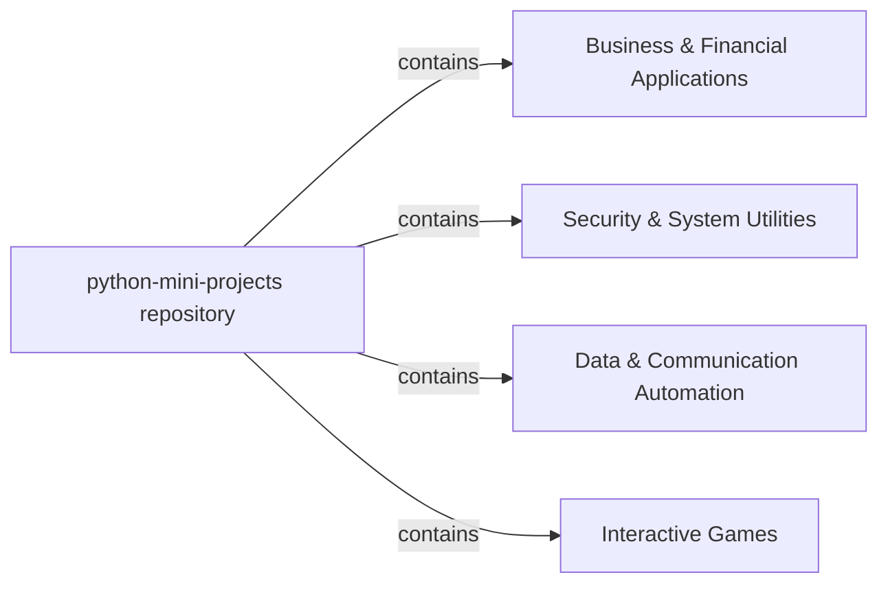

## Details

A monorepo of independent, self-contained Python applications and scripts.

### python-mini-projects repository
A monorepo of independent, self-contained Python applications and scripts.

**Related Classes/Methods**: _None_

### Business & Financial Applications
Manages billing operations and provides a user interface for a simple billing system.

**Related Classes/Methods**:

- <a href="https://github.com/Python-World/python-mini-projects/blob/master/projects/Billing_system/biling_system.py#L6-L419" target="_blank" rel="noopener noreferrer">`projects.Billing_system.biling_system.Bill_App` (6:419)</a>

### Security & System Utilities
A collection of tools focused on security (CAPTCHA, password generation, ZIP cracking) and system information retrieval (Wi-Fi passwords).

**Related Classes/Methods**:

- <a href="https://github.com/Python-World/python-mini-projects/blob/master/projects/Captcha_Genrator/Captcha_Genrator.py#L1-L1" target="_blank" rel="noopener noreferrer">`projects.Captcha_Genrator.Captcha_Genrator` (1:1)</a>
- <a href="https://github.com/Python-World/python-mini-projects/blob/master/projects/Password_generator/password_generator.py#L4-L36" target="_blank" rel="noopener noreferrer">`projects.Password_generator.password_generator.App` (4:36)</a>
- <a href="https://github.com/Python-World/python-mini-projects/blob/master/projects/Zip_Bruter/zipbruter.py#L19-L73" target="_blank" rel="noopener noreferrer">`projects.Zip_Bruter.zipbruter.ZipBruter` (19:73)</a>
- <a href="https://github.com/Python-World/python-mini-projects/blob/master/projects/Wifi_windows_password_displayer/main.py#L5-L56" target="_blank" rel="noopener noreferrer">`projects.Wifi_windows_password_displayer.main.PwdDisplay` (5:56)</a>

### Data & Communication Automation
Handles automated tasks involving data processing (image metadata extraction) and communication (email sending from CSV).

**Related Classes/Methods**:

- <a href="https://github.com/Python-World/python-mini-projects/blob/master/projects/Get_meta_information_of_images/author_utils.py#L1-L1" target="_blank" rel="noopener noreferrer">`projects.Get_meta_information_of_images.author_utils` (1:1)</a>
- <a href="https://github.com/Python-World/python-mini-projects/blob/master/projects/Send_email_from_csv/Sending_mail.py#L1-L1" target="_blank" rel="noopener noreferrer">`projects.Send_email_from_csv.Sending_mail` (1:1)</a>

### Interactive Games [[Expand]](./Interactive_Games.md)
Contains graphical user interface-based games, including a MasterMind implementation and a speed-typing/reaction game with OS-specific versions.

**Related Classes/Methods**:

- <a href="https://github.com/Python-World/python-mini-projects/blob/master/projects/MasterMind/Mastermind_GUIinterface.py#L21-L95" target="_blank" rel="noopener noreferrer">`projects.MasterMind.Mastermind_GUIinterface.MasterMind` (21:95)</a>
- <a href="https://github.com/Python-World/python-mini-projects/blob/master/projects/Speed_Game/macOS/main.py#L15-L26" target="_blank" rel="noopener noreferrer">`projects.Speed_Game.macOS.main.SampleApp` (15:26)</a>
- <a href="https://github.com/Python-World/python-mini-projects/blob/master/projects/Speed_Game/macOS/main.py#L81-L236" target="_blank" rel="noopener noreferrer">`projects.Speed_Game.macOS.main.CountryPage` (81:236)</a>
- <a href="https://github.com/Python-World/python-mini-projects/blob/master/projects/Speed_Game/windows/main.py#L18-L29" target="_blank" rel="noopener noreferrer">`projects.Speed_Game.windows.main.SampleApp` (18:29)</a>
- <a href="https://github.com/Python-World/python-mini-projects/blob/master/projects/Speed_Game/windows/main.py#L84-L239" target="_blank" rel="noopener noreferrer">`projects.Speed_Game.windows.main.CountryPage` (84:239)</a>

### [FAQ](https://github.com/CodeBoarding/GeneratedOnBoardings/tree/main?tab=readme-ov-file#faq)