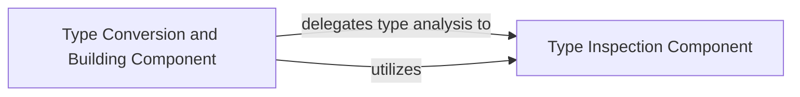

## Details

The `nubia.internal.typing` subsystem is primarily composed of two high-level architectural components: the `Type Inspection Component` and the `Type Conversion and Building Component`. The `Type Inspection Component` serves as the foundational layer, providing essential utilities for analyzing and understanding Python type characteristics, such as identifying mappings, iterables, or handling generic aliases. Building upon this, the `Type Conversion and Building Component` is the core processing unit. It takes raw input values and, by leveraging the insights from the `Type Inspection Component`, orchestrates their conversion into the correct Python types. This involves applying type-specific logic, recursively handling complex data structures, and ensuring safe evaluation of expressions. Together, these components form a robust system for type-safe argument processing and value construction within the `nubia` framework.

### Type Inspection Component
Provides foundational utilities for analyzing Python types. It determines characteristics such as whether a type is a mapping, iterable, or list, and handles generic type aliases. This component is crucial for understanding the expected structure and constraints of arguments.

**Related Classes/Methods**:

- <a href="https://github.com/facebookarchive/python-nubia/blob/main/nubia/internal/typing/inspect.py#L1-L10000" target="_blank" rel="noopener noreferrer">`nubia.internal.typing.inspect`:1-10000</a>

### Type Conversion and Building Component
This consolidated component is responsible for the comprehensive process of converting raw input values (typically strings from the command line) into their appropriate Python types. It orchestrates value building, applies type-specific logic, retrieves the correct builders for various types, and handles complex or nested structures recursively. It also includes mechanisms for safe evaluation of expressions (e.g., for default values or dynamic type construction) and utilities for handling specific data structures like dictionary values. This component acts as the central hub for all type-driven value processing and construction within the `nubia.internal.typing.builder` module.

**Related Classes/Methods**:

- <a href="https://github.com/facebookarchive/python-nubia/blob/main/nubia/internal/typing/builder.py#L1-L10000" target="_blank" rel="noopener noreferrer">`nubia.internal.typing.builder`:1-10000</a>

### [FAQ](https://github.com/CodeBoarding/GeneratedOnBoardings/tree/main?tab=readme-ov-file#faq)