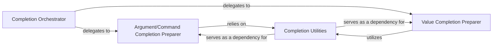

## Details

The Auto-completion Engine subsystem is primarily encapsulated within the nubia.internal.completion module. It is responsible for providing intelligent, context-aware suggestions to the user as they type in the interactive shell, aligning with the project's strong bias towards a rich interactive user experience.

### Completion Orchestrator
This is the primary entry point for the auto-completion process. It receives the current input and delegates the task of generating completion candidates to specialized preparers based on the context (e.g., whether an argument or a value is expected).

**Related Classes/Methods**:

- <a href="https://github.com/facebookarchive/python-nubia/blob/main/nubia/internal/completion.py#L125-L159" target="_blank" rel="noopener noreferrer">`nubia.internal.completion.get_completions`:125-159</a>

### Argument/Command Completion Preparer
Focuses on suggesting commands, subcommands, and arguments (flags or positional) that can logically follow the current input. It analyzes the input tokens to determine valid next commands or arguments.

**Related Classes/Methods**:

- <a href="https://github.com/facebookarchive/python-nubia/blob/main/nubia/internal/completion.py#L161-L229" target="_blank" rel="noopener noreferrer">`nubia.internal.completion._prepare_args_completions`:161-229</a>

### Value Completion Preparer
Specializes in providing possible values for a specific argument or option once that argument has been identified. It uses argument metadata to narrow down and suggest appropriate values.

**Related Classes/Methods**:

- <a href="https://github.com/facebookarchive/python-nubia/blob/main/nubia/internal/completion.py#L239-L255" target="_blank" rel="noopener noreferrer">`nubia.internal.completion._prepare_value_completions`:239-255</a>

### Completion Utilities
A foundational set of helper functions and classes that provide essential low-level capabilities for the completion process. This includes parsing the input string into tokens (TokenParse), identifying argument types, and retrieving argument metadata. These utilities are crucial for both argument and value completion logic.

**Related Classes/Methods**:

- <a href="https://github.com/facebookarchive/python-nubia/blob/main/nubia/internal/completion.py#L25-L101" target="_blank" rel="noopener noreferrer">`nubia.internal.completion.TokenParse`:25-101</a>
- <a href="https://github.com/facebookarchive/python-nubia/blob/main/nubia/internal/completion.py#L40-L65" target="_blank" rel="noopener noreferrer">`nubia.internal.completion.parse`:40-65</a>
- <a href="https://github.com/facebookarchive/python-nubia/blob/main/nubia/internal/completion.py#L67-L69" target="_blank" rel="noopener noreferrer">`nubia.internal.completion.is_argument`:67-69</a>
- <a href="https://github.com/facebookarchive/python-nubia/blob/main/nubia/internal/completion.py#L268-L284" target="_blank" rel="noopener noreferrer">`nubia.internal.completion._get_arg_help`:268-284</a>
- <a href="https://github.com/facebookarchive/python-nubia/blob/main/nubia/internal/completion.py#L231-L237" target="_blank" rel="noopener noreferrer">`nubia.internal.completion._filter_arguments_by_prefix`:231-237</a>

### [FAQ](https://github.com/CodeBoarding/GeneratedOnBoardings/tree/main?tab=readme-ov-file#faq)