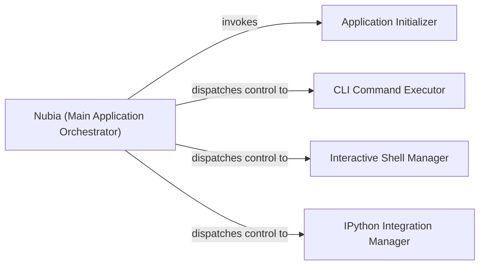

## Details

The Nubia application's core functionality is orchestrated by the `Nubia (Main Application Orchestrator)`, primarily through its `run_async` method. Upon initiation, the orchestrator first invokes the `Application Initializer` (`_pre_run` method) to perform essential setup tasks such as argument parsing, logging configuration, and terminal environment preparation. Following initialization, the `Nubia (Main Application Orchestrator)` dynamically dispatches control based on the parsed command-line arguments. It can direct execution to the `CLI Command Executor` (`run_cli` method) for direct command execution, the `Interactive Shell Manager` (`start_interactive` method) for an interactive REPL session, or the `IPython Integration Manager` (`start_ipython` method) for seamless integration within an IPython environment. This clear, sequential flow ensures proper setup and flexible execution pathways within the Nubia CLI.

### Nubia (Main Application Orchestrator)
The primary entry point and orchestrator for the Nubia CLI application. It manages the overall execution flow, including pre-run setup, direct CLI command execution, interactive shell mode, and IPython integration.

**Related Classes/Methods**:

- <a href="https://github.com/facebookarchive/python-nubia/blob/main/nubia/internal/nubia.py#L300-L334" target="_blank" rel="noopener noreferrer">`nubia.internal.nubia.Nubia.run_async`:300-334</a>

### Application Initializer
Handles all preliminary setup tasks required before the main application logic begins. This includes configuring logging, parsing global command-line arguments, validating arguments, and setting up the terminal environment.

**Related Classes/Methods**:

- <a href="https://github.com/facebookarchive/python-nubia/blob/main/nubia/internal/nubia.py#L200-L298" target="_blank" rel="noopener noreferrer">`nubia.internal.nubia.Nubia._pre_run`:200-298</a>

### CLI Command Executor
Executes commands directly based on the command-line arguments provided at application startup, bypassing the interactive shell.

**Related Classes/Methods**:

- <a href="https://github.com/facebookarchive/python-nubia/blob/main/nubia/internal/nubia.py#L170-L198" target="_blank" rel="noopener noreferrer">`nubia.internal.nubia.Nubia.run_cli`:170-198</a>

### Interactive Shell Manager
Manages the interactive shell environment, including setting up the input/output loop, handling user interactions, and integrating features like auto-completion within the REPL.

**Related Classes/Methods**:

- <a href="https://github.com/facebookarchive/python-nubia/blob/main/nubia/internal/nubia.py#L120-L168" target="_blank" rel="noopener noreferrer">`nubia.internal.nubia.Nubia.start_interactive`:120-168</a>

### IPython Integration Manager
Facilitates the integration of Nubia commands and functionalities within an IPython environment, allowing users to interact with Nubia from an IPython shell.

**Related Classes/Methods**:

- <a href="https://github.com/facebookarchive/python-nubia/blob/main/nubia/internal/ipython.py#L26-L59" target="_blank" rel="noopener noreferrer">`nubia.internal.ipython.start_interactive_python`:26-59</a>

### [FAQ](https://github.com/CodeBoarding/GeneratedOnBoardings/tree/main?tab=readme-ov-file#faq)