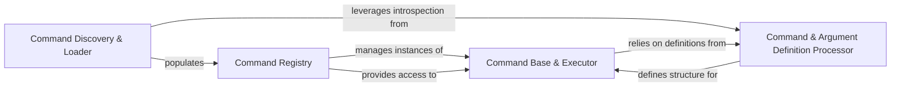

## Details

The `Command Definition & Registry` subsystem is a cornerstone of the `nubia` CLI framework, responsible for the declarative definition, discovery, and centralized management of all available commands and their associated metadata. This subsystem embodies the framework's architectural bias towards modularity, extensibility, and declarative command definition.

### Command Base & Executor
Establishes the fundamental structure and behavior for all commands. It defines the base class (`Command`) that all user-defined commands inherit from, providing common attributes (e.g., help text, subcommands) and orchestrating the execution flow. It acts as the runtime representation of a command. This component is crucial as it provides the concrete foundation upon which all commands are built and executed.

**Related Classes/Methods**:

- <a href="https://github.com/facebookarchive/python-nubia/blob/main/nubia/internal/cmdbase.py" target="_blank" rel="noopener noreferrer">`nubia.internal.cmdbase`</a>

### Command & Argument Definition Processor
Offers a declarative API, primarily through decorators, for defining commands and their arguments. `nubia.internal.typing` handles type conversions and validation for arguments, ensuring robust input processing. `nubia.internal.options` defines the structure or decorators for command-line options and flags. This component is vital for enabling the declarative and extensible nature of command definition, a key architectural pattern.

**Related Classes/Methods**:

- <a href="https://github.com/facebookarchive/python-nubia/blob/main/nubia/internal/typing" target="_blank" rel="noopener noreferrer">`nubia.internal.typing`</a>
- <a href="https://github.com/facebookarchive/python-nubia/blob/main/nubia/internal/options.py" target="_blank" rel="noopener noreferrer">`nubia.internal.options`</a>

### Command Discovery & Loader
Scans specified packages and modules to locate and load command definitions. It identifies classes decorated as commands and prepares them for instantiation and registration. This component is essential for the plugin/extension pattern, allowing new commands to be dynamically added to the CLI.

**Related Classes/Methods**:

- <a href="https://github.com/facebookarchive/python-nubia/blob/main/nubia/internal/cmdloader.py" target="_blank" rel="noopener noreferrer">`nubia.internal.cmdloader`</a>

### Command Registry
Functions as the central, searchable repository for all loaded and registered commands. It maintains a collection of command objects and their associated metadata, enabling other parts of the system to efficiently query and retrieve command information. This component is fundamental for the Command Pattern, providing a centralized lookup mechanism for command dispatch.

**Related Classes/Methods**:

- <a href="https://github.com/facebookarchive/python-nubia/blob/main/nubia/internal/registry.py" target="_blank" rel="noopener noreferrer">`nubia.internal.registry`</a>

### [FAQ](https://github.com/CodeBoarding/GeneratedOnBoardings/tree/main?tab=readme-ov-file#faq)