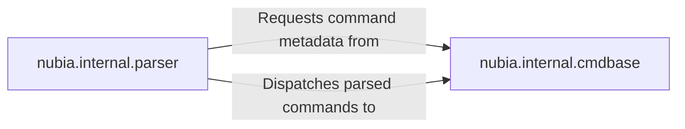

## Details

The `nubia.internal.parser` and `nubia.internal.cmdbase` components form the core of the command processing subsystem. The `parser` is responsible for interpreting user input and transforming it into a structured command. During this process, it actively requests command metadata and validation rules from the `cmdbase` to ensure the input's correctness. Once the input is successfully parsed and validated, the `parser` dispatches the structured command to the `cmdbase`, which then handles the execution by invoking the appropriate command handler based on its stored definitions. This clear separation of concerns ensures robust command interpretation and execution within the system.

### nubia.internal.parser
This component serves as the primary parsing engine. Its core responsibility is to interpret raw user input (whether from the CLI or the interactive shell), transforming it into a structured command object. This involves identifying the command name, any subcommands, and associated arguments. It requests command metadata and validation rules from `nubia.internal.cmdbase` to perform initial syntactic and semantic validation before dispatching the parsed command.

**Related Classes/Methods**:

- <a href="https://github.com/facebookarchive/python-nubia/blob/main/nubia/internal/parser.py" target="_blank" rel="noopener noreferrer">`nubia.internal.parser`</a>

### nubia.internal.cmdbase
This component acts as the central repository for all command definitions and the ultimate dispatch target. It defines the structure and metadata of available commands, including their arguments, help messages, and the underlying execution logic. It is responsible for storing and managing these definitions, providing command metadata to `nubia.internal.parser` for validation, and receiving parsed commands from `nubia.internal.parser` to invoke the appropriate command handler.

**Related Classes/Methods**:

- <a href="https://github.com/facebookarchive/python-nubia/blob/main/nubia/internal/cmdbase.py" target="_blank" rel="noopener noreferrer">`nubia.internal.cmdbase`</a>

### [FAQ](https://github.com/CodeBoarding/GeneratedOnBoardings/tree/main?tab=readme-ov-file#faq)