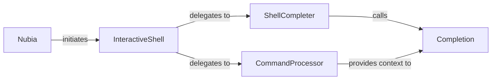

## Details

Analysis of the Interactive Shell subsystem in Nubia.

### Nubia
The top-level entry point of the application, responsible for initializing and orchestrating the main components, including the interactive shell. It acts as the overall application context manager.

**Related Classes/Methods**:

- <a href="https://github.com/facebookarchive/python-nubia/blob/main/nubia/internal/nubia.py#L69-L334" target="_blank" rel="noopener noreferrer">`nubia.internal.nubia.Nubia`:69-334</a>

### InteractiveShell
The central orchestrator of the REPL cycle. It manages displaying prompts and status bars, reading user input, and delegating the evaluation and printing of results. It is the direct implementation of the "Interactive Shell/REPL Engine" pattern.

**Related Classes/Methods**:

- <a href="https://github.com/facebookarchive/python-nubia/blob/main/nubia/internal/interactive.py" target="_blank" rel="noopener noreferrer">`nubia.internal.interactive.InteractiveShell`</a>

### CommandProcessor
Responsible for parsing raw user input strings into structured commands and arguments, and subsequently executing these commands. This component directly supports the "Command Parser/Dispatcher" pattern within the interactive environment.

**Related Classes/Methods**:

- <a href="https://github.com/facebookarchive/python-nubia/blob/main/nubia/internal/interactive.py" target="_blank" rel="noopener noreferrer">`nubia.internal.interactive.CommandProcessor`</a>

### ShellCompleter
Acts as an adapter between the `InteractiveShell` and the detailed auto-completion logic. It translates completion requests from the interactive environment into calls to the core completion engine.

**Related Classes/Methods**:

- <a href="https://github.com/facebookarchive/python-nubia/blob/main/nubia/internal/interactive.py#L177-L203" target="_blank" rel="noopener noreferrer">`nubia.internal.interactive.ShellCompleter`:177-203</a>

### Completion
Encapsulates the detailed, context-aware logic for generating auto-completion suggestions for commands, arguments, and values. This is the core of the "Auto-completion Engine".

**Related Classes/Methods**:

- <a href="https://github.com/facebookarchive/python-nubia/blob/main/nubia/internal/completion.py" target="_blank" rel="noopener noreferrer">`nubia.internal.completion.Completion`</a>

### [FAQ](https://github.com/CodeBoarding/GeneratedOnBoardings/tree/main?tab=readme-ov-file#faq)