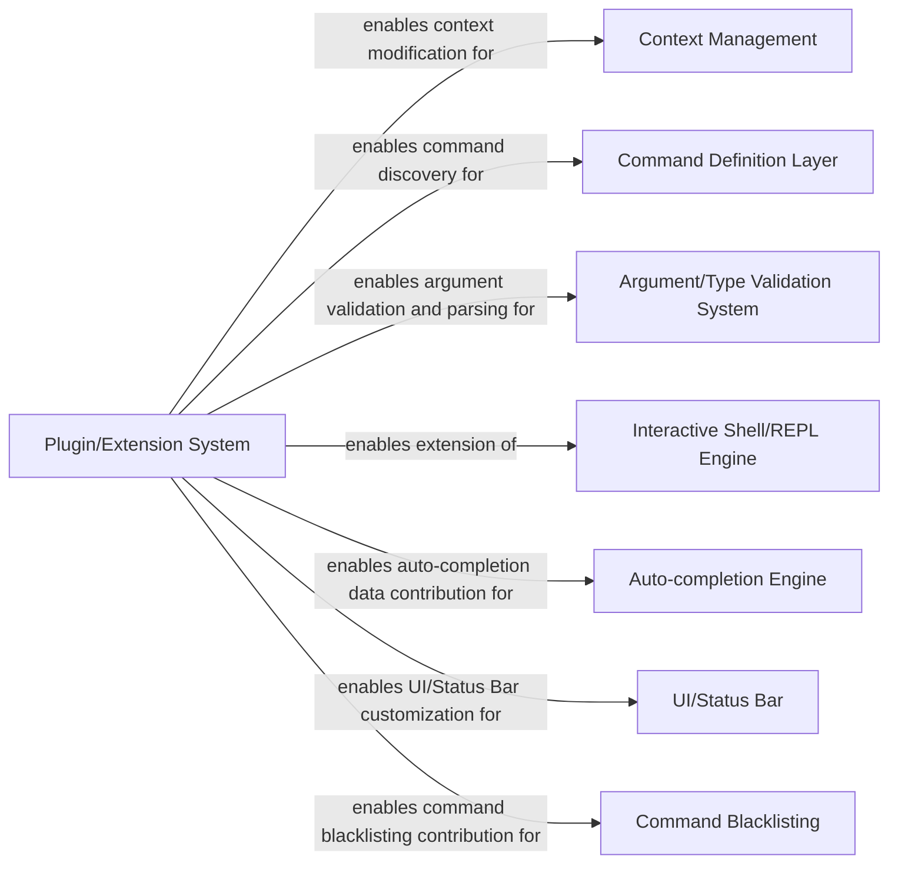

## Details

The Plugin/Extension System in Nubia is a critical architectural component that embodies the framework's commitment to modularity and extensibility. It provides a well-defined interface, primarily through `nubia.internal.plugin_interface.PluginInterface`, allowing developers to inject custom logic and extend core functionalities without modifying the main codebase.

### Plugin/Extension System [[Expand]](./Plugin_Extension_System.md)
The foundational interface (PluginInterface) that defines the contract for extending the core CLI framework. It acts as the central hub through which all other components within this subsystem expose their extension points.

**Related Classes/Methods**:

- <a href="https://github.com/facebookarchive/python-nubia/blob/main/nubia/internal/plugin_interface.py#L29-L159" target="_blank" rel="noopener noreferrer">`nubia.internal.plugin_interface.PluginInterface`:29-159</a>

### Context Management
Manages the application's runtime context and state. The Plugin System allows plugins to create and modify this context, ensuring that commands and other components operate within a consistent environment.

**Related Classes/Methods**:

- <a href="https://github.com/facebookarchive/python-nubia/blob/main/nubia/internal/context.py" target="_blank" rel="noopener noreferrer">`nubia.internal.context`</a>
- <a href="https://github.com/facebookarchive/python-nubia/blob/main/nubia/internal/plugin_interface.py" target="_blank" rel="noopener noreferrer">`nubia.internal.plugin_interface.PluginInterface:create_context`</a>

### Command Definition Layer
Responsible for defining and exposing CLI commands. The Plugin System utilizes this layer to discover and register commands provided by extensions, making them available for execution within the CLI.

**Related Classes/Methods**:

- <a href="https://github.com/facebookarchive/python-nubia/blob/main/nubia/internal/plugin_interface.py" target="_blank" rel="noopener noreferrer">`nubia.internal.plugin_interface.PluginInterface:get_commands`</a>

### Argument/Type Validation System
Handles the parsing and validation of command-line arguments and options. The Plugin System allows plugins to hook into this process, providing custom validation logic or argument parsers.

**Related Classes/Methods**:

- <a href="https://github.com/facebookarchive/python-nubia/blob/main/nubia/internal/plugin_interface.py" target="_blank" rel="noopener noreferrer">`nubia.internal.plugin_interface.PluginInterface:validate_args`</a>
- <a href="https://github.com/facebookarchive/python-nubia/blob/main/nubia/internal/plugin_interface.py" target="_blank" rel="noopener noreferrer">`nubia.internal.plugin_interface.PluginInterface:get_opts_parser`</a>

### Interactive Shell/REPL Engine
Provides the core interactive shell experience, including handling user input, executing commands, and managing the REPL loop. The Plugin System enables plugins to extend this engine with custom "magic" commands, modify prompt tokens, and update IPython configurations.

**Related Classes/Methods**:

- <a href="https://github.com/facebookarchive/python-nubia/blob/main/nubia/internal/plugin_interface.py" target="_blank" rel="noopener noreferrer">`nubia.internal.plugin_interface.PluginInterface:get_magics`</a>
- <a href="https://github.com/facebookarchive/python-nubia/blob/main/nubia/internal/plugin_interface.py" target="_blank" rel="noopener noreferrer">`nubia.internal.plugin_interface.PluginInterface:get_prompt_tokens`</a>
- <a href="https://github.com/facebookarchive/python-nubia/blob/main/nubia/internal/plugin_interface.py" target="_blank" rel="noopener noreferrer">`nubia.internal.plugin_interface.PluginInterface:update_ipython_kwargs`</a>

### Auto-completion Engine [[Expand]](./Auto_completion_Engine.md)
Facilitates intelligent auto-completion for commands and arguments within the interactive shell. The Plugin System allows plugins to contribute data sources for auto-completion, enhancing the user experience.

**Related Classes/Methods**:

- <a href="https://github.com/facebookarchive/python-nubia/blob/main/nubia/internal/plugin_interface.py" target="_blank" rel="noopener noreferrer">`nubia.internal.plugin_interface.PluginInterface:get_completion_datasource_for_global_argument`</a>

### UI/Status Bar
Manages the display and content of the interactive shell's status bar, providing real-time feedback to the user. The Plugin System allows plugins to customize the status bar's appearance and information.

**Related Classes/Methods**:

- <a href="https://github.com/facebookarchive/python-nubia/blob/main/nubia/internal/ui/statusbar.py" target="_blank" rel="noopener noreferrer">`nubia.internal.ui.statusbar`</a>
- <a href="https://github.com/facebookarchive/python-nubia/blob/main/nubia/internal/plugin_interface.py" target="_blank" rel="noopener noreferrer">`nubia.internal.plugin_interface.PluginInterface:get_status_bar`</a>

### Command Blacklisting
Implements logic to prevent certain commands from being executed, based on predefined rules or user configurations. The Plugin System allows plugins to define and contribute to this blacklisting mechanism.

**Related Classes/Methods**:

- <a href="https://github.com/facebookarchive/python-nubia/blob/main/nubia/internal/blackcmd.py" target="_blank" rel="noopener noreferrer">`nubia.internal.blackcmd`</a>
- <a href="https://github.com/facebookarchive/python-nubia/blob/main/nubia/internal/plugin_interface.py" target="_blank" rel="noopener noreferrer">`nubia.internal.plugin_interface.PluginInterface:getBlacklistPlugin`</a>

### [FAQ](https://github.com/CodeBoarding/GeneratedOnBoardings/tree/main?tab=readme-ov-file#faq)