```mermaid
graph LR
    CLI_Application_Core["CLI Application Core"]
    Command_Definition_Registry["Command Definition & Registry"]
    Interactive_Shell["Interactive Shell"]
    Command_Parser_Dispatcher["Command Parser & Dispatcher"]
    Argument_Type_Validation["Argument & Type Validation"]
    Auto_completion_Engine["Auto-completion Engine"]
    Context_Management["Context Management"]
    Plugin_Extension_System["Plugin/Extension System"]
    CLI_Application_Core -- "delegates control to" --> Interactive_Shell
    CLI_Application_Core -- "delegates control to" --> Command_Parser_Dispatcher
    Interactive_Shell -- "submits commands to" --> Command_Parser_Dispatcher
    Interactive_Shell -- "requests suggestions from" --> Auto_completion_Engine
    Command_Parser_Dispatcher -- "queries" --> Command_Definition_Registry
    Command_Parser_Dispatcher -- "sends arguments to" --> Argument_Type_Validation
    Argument_Type_Validation -- "returns validated arguments to" --> Command_Parser_Dispatcher
    Command_Parser_Dispatcher -- "invokes logic via" --> Command_Definition_Registry
    Auto_completion_Engine -- "retrieves metadata from" --> Command_Definition_Registry
    Plugin_Extension_System -- "registers commands in" --> Command_Definition_Registry
    Plugin_Extension_System -- "hooks into" --> CLI_Application_Core
    Command_Parser_Dispatcher -- "accesses/updates" --> Context_Management
    Command_Definition_Registry -- "accesses" --> Context_Management
    click CLI_Application_Core href "https://github.com/CodeBoarding/GeneratedOnBoardings/blob/main/python-nubia/CLI_Application_Core.md" "Details"
    click Command_Definition_Registry href "https://github.com/CodeBoarding/GeneratedOnBoardings/blob/main/python-nubia/Command_Definition_Registry.md" "Details"
    click Interactive_Shell href "https://github.com/CodeBoarding/GeneratedOnBoardings/blob/main/python-nubia/Interactive_Shell.md" "Details"
    click Command_Parser_Dispatcher href "https://github.com/CodeBoarding/GeneratedOnBoardings/blob/main/python-nubia/Command_Parser_Dispatcher.md" "Details"
    click Argument_Type_Validation href "https://github.com/CodeBoarding/GeneratedOnBoardings/blob/main/python-nubia/Argument_Type_Validation.md" "Details"
    click Auto_completion_Engine href "https://github.com/CodeBoarding/GeneratedOnBoardings/blob/main/python-nubia/Auto_completion_Engine.md" "Details"
    click Plugin_Extension_System href "https://github.com/CodeBoarding/GeneratedOnBoardings/blob/main/python-nubia/Plugin_Extension_System.md" "Details"
```

## Details

The `python-nubia` architecture is designed as a modular and extensible CLI framework, prioritizing a rich interactive user experience. At its core, the **CLI Application Core** orchestrates the entire process, directing user input either to the **Interactive Shell** for REPL-based interaction or directly to the **Command Parser & Dispatcher** for immediate execution. Commands are defined declaratively and managed by the **Command Definition & Registry**, which serves as the authoritative source for command metadata and discovery. The **Command Parser & Dispatcher** interprets user input, leveraging the **Argument & Type Validation** system to ensure data integrity before invoking command logic. For interactive sessions, the **Auto-completion Engine** enhances usability by providing intelligent suggestions. The framework maintains shared state through **Context Management** and supports dynamic extensibility via its **Plugin/Extension System**, allowing for a highly customizable and adaptable command-line environment. This structure facilitates clear data flow from user input through command processing to execution, making it ideal for visual representation as a flow graph.

### CLI Application Core [[Expand]](./CLI_Application_Core.md)
The central entry point and orchestrator of the Nubia CLI framework. It initializes the application, handles global arguments, and dispatches control to either the interactive shell or direct command execution.

**Related Classes/Methods**:

- <a href="https://github.com/facebookarchive/python-nubia/blob/main/nubia/internal/nubia.py" target="_blank" rel="noopener noreferrer">`nubia.internal.nubia`</a>

### Command Definition & Registry [[Expand]](./Command_Definition_Registry.md)
Provides declarative mechanisms for defining commands and their arguments using decorators, and maintains a central, searchable registry of all available commands and their metadata.

**Related Classes/Methods**:

- <a href="https://github.com/facebookarchive/python-nubia/blob/main/nubia/internal/cmdbase.py" target="_blank" rel="noopener noreferrer">`nubia.internal.cmdbase`</a>
- <a href="https://github.com/facebookarchive/python-nubia/blob/main/nubia/internal/options.py" target="_blank" rel="noopener noreferrer">`nubia.internal.options`</a>
- <a href="https://github.com/facebookarchive/python-nubia/blob/main/nubia/internal/typing/__init__.py" target="_blank" rel="noopener noreferrer">`nubia.internal.typing`</a>
- <a href="https://github.com/facebookarchive/python-nubia/blob/main/nubia/internal/cmdloader.py" target="_blank" rel="noopener noreferrer">`nubia.internal.cmdloader`</a>

### Interactive Shell [[Expand]](./Interactive_Shell.md)
Manages the Read-Eval-Print Loop (REPL) for interactive user sessions, including displaying prompts, handling user input, and integrating with auto-completion.

**Related Classes/Methods**:

- <a href="https://github.com/facebookarchive/python-nubia/blob/main/nubia/internal/interactive.py" target="_blank" rel="noopener noreferrer">`nubia.internal.interactive`</a>

### Command Parser & Dispatcher [[Expand]](./Command_Parser_Dispatcher.md)
Responsible for interpreting raw user input, parsing it into a structured command and arguments, validating the command's existence, and dispatching execution to the appropriate handler.

**Related Classes/Methods**:

- <a href="https://github.com/facebookarchive/python-nubia/blob/main/nubia/internal/parser.py" target="_blank" rel="noopener noreferrer">`nubia.internal.parser`</a>
- <a href="https://github.com/facebookarchive/python-nubia/blob/main/nubia/internal/cmdbase.py" target="_blank" rel="noopener noreferrer">`nubia.internal.cmdbase`</a>

### Argument & Type Validation [[Expand]](./Argument_Type_Validation.md)
Ensures that command arguments conform to their defined types and constraints, applying necessary transformations or validations before command execution.

**Related Classes/Methods**:

- <a href="https://github.com/facebookarchive/python-nubia/blob/main/nubia/internal/typing/builder.py" target="_blank" rel="noopener noreferrer">`nubia.internal.typing.builder`</a>
- <a href="https://github.com/facebookarchive/python-nubia/blob/main/nubia/internal/typing/inspect.py" target="_blank" rel="noopener noreferrer">`nubia.internal.typing.inspect`</a>

### Auto-completion Engine [[Expand]](./Auto_completion_Engine.md)
Provides intelligent, context-aware suggestions for commands, subcommands, and arguments as the user types in the interactive shell.

**Related Classes/Methods**:

- <a href="https://github.com/facebookarchive/python-nubia/blob/main/nubia/internal/completion.py" target="_blank" rel="noopener noreferrer">`nubia.internal.completion`</a>

### Context Management
Manages the application's runtime context, which includes global options, session-specific data, and shared resources, making it available to commands during execution.

**Related Classes/Methods**:

- <a href="https://github.com/facebookarchive/python-nubia/blob/main/nubia/internal/context.py" target="_blank" rel="noopener noreferrer">`nubia.internal.context`</a>

### Plugin/Extension System [[Expand]](./Plugin_Extension_System.md)
Offers a well-defined interface for extending the core CLI framework, allowing developers to add new commands or modify behaviors without altering the core codebase.

**Related Classes/Methods**:

- <a href="https://github.com/facebookarchive/python-nubia/blob/main/nubia/internal/plugin_interface.py" target="_blank" rel="noopener noreferrer">`nubia.internal.plugin_interface`</a>

### [FAQ](https://github.com/CodeBoarding/GeneratedOnBoardings/tree/main?tab=readme-ov-file#faq)