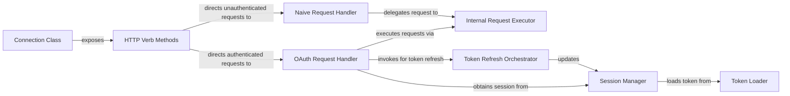

## Details

The API Request Handler subsystem is primarily encapsulated within the `O365.connection` module, specifically centered around the `O365.connection.Connection` class and its associated methods. It provides the core HTTP communication and authentication integration for the Microsoft Graph API.

### Connection Class
Acts as the central orchestrator and facade for all HTTP communication with the Microsoft Graph API. It manages the session, provides a unified interface for various HTTP operations, and integrates authentication flows.

**Related Classes/Methods**:

- <a href="https://github.com/O365/python-o365/blob/master/O365/connection.py#L362-L1158" target="_blank" rel="noopener noreferrer">`O365.connection.Connection`:362-1158</a>

### HTTP Verb Methods
Serve as the primary public interface for performing standard HTTP operations. They abstract the underlying request handling and direct requests to either authenticated or unauthenticated paths.

**Related Classes/Methods**:

- <a href="https://github.com/O365/python-o365/blob/master/O365/connection.py" target="_blank" rel="noopener noreferrer">`O365.connection.Connection.get`</a>
- <a href="https://github.com/O365/python-o365/blob/master/O365/connection.py" target="_blank" rel="noopener noreferrer">`O365.connection.Connection.post`</a>
- <a href="https://github.com/O365/python-o365/blob/master/O365/connection.py" target="_blank" rel="noopener noreferrer">`O365.connection.Connection.put`</a>
- <a href="https://github.com/O365/python-o365/blob/master/O365/connection.py" target="_blank" rel="noopener noreferrer">`O365.connection.Connection.patch`</a>
- <a href="https://github.com/O365/python-o365/blob/master/O365/connection.py" target="_blank" rel="noopener noreferrer">`O365.connection.Connection.delete`</a>

### OAuth Request Handler
Prepares and executes authenticated API requests, ensuring an authenticated session is used and handling token refresh. It acts as an adapter between public HTTP methods and internal request execution, integrating authentication.

**Related Classes/Methods**:

- <a href="https://github.com/O365/python-o365/blob/master/O365/connection.py" target="_blank" rel="noopener noreferrer">`O365.connection.Connection.oauth_request`</a>

### Internal Request Executor
The fundamental method for executing the actual HTTP request using an underlying library (e.g., `requests`). It handles low-level concerns such as error checking, response parsing, and delay mechanisms.

**Related Classes/Methods**:

- <a href="https://github.com/O365/python-o365/blob/master/O365/connection.py" target="_blank" rel="noopener noreferrer">`O365.connection.Connection._internal_request`</a>

### Token Refresh Orchestrator
Manages the process of refreshing an expired authentication token, ensuring continuous access to the API by delegating to the actual refresh logic and updating the session.

**Related Classes/Methods**:

- <a href="https://github.com/O365/python-o365/blob/master/O365/connection.py" target="_blank" rel="noopener noreferrer">`O365.connection.Connection._try_refresh_token`</a>

### Session Manager [[Expand]](./Session_Manager.md)
Provides an authenticated session object, ensuring the token is loaded from the backend and the session is properly configured with the authorization header.

**Related Classes/Methods**:

- <a href="https://github.com/O365/python-o365/blob/master/O365/connection.py" target="_blank" rel="noopener noreferrer">`O365.connection.Connection.get_session`</a>

### Token Loader
Handles loading the authentication token from the configured storage backend, making it available for session creation and updates.

**Related Classes/Methods**:

- <a href="https://github.com/O365/python-o365/blob/master/O365/connection.py" target="_blank" rel="noopener noreferrer">`O365.connection.Connection.load_token_from_backend`</a>

### Naive Request Handler
Provides a separate entry point for unauthenticated requests, bypassing the OAuth flow. This is used for specific scenarios where authentication is not required.

**Related Classes/Methods**:

- <a href="https://github.com/O365/python-o365/blob/master/O365/connection.py" target="_blank" rel="noopener noreferrer">`O365.connection.Connection.naive_request`</a>

### [FAQ](https://github.com/CodeBoarding/GeneratedOnBoardings/tree/main?tab=readme-ov-file#faq)