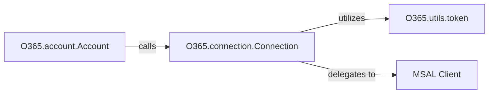

## Details

The `O365` library's authentication and connection subsystem is designed around a clear separation of concerns, facilitating robust and secure interactions with Microsoft 365 services. The `O365.account.Account` acts as the primary entry point for users, abstracting the complexities of the OAuth 2.0 flow. It delegates the core responsibilities of session management, token handling, and API request execution to the `O365.connection.Connection` component. This central connection manager orchestrates the authentication process by interacting with the underlying MSAL (Microsoft Authentication Library) client for token acquisition and refresh. Token persistence and retrieval are handled by `O365.utils.token`, ensuring secure and efficient token management. All authenticated API calls are routed through the `O365.connection.Connection`, which ensures proper authorization and handles token expiration and refresh transparently.

### O365.account.Account
Serves as the high-level facade for initiating the OAuth 2.0 authentication flow, guiding the user through authorization and token acquisition. It represents the user's authenticated session, providing a simplified interface to the underlying connection management. This component embodies the Facade Pattern.

**Related Classes/Methods**:

- <a href="https://github.com/O365/python-o365/blob/master/O365/account.py" target="_blank" rel="noopener noreferrer">`O365.account.Account`</a>

### O365.connection.Connection
The central component managing the entire authenticated session lifecycle. This includes obtaining authorization URLs, requesting and refreshing access tokens, maintaining session state, and executing all API requests with proper authentication headers. It also encapsulates the logic for handling token expiration and refreshing tokens by interacting with the MSAL client. It embodies the API Client/Connection Layer pattern.

**Related Classes/Methods**:

- <a href="https://github.com/O365/python-o365/blob/master/O365/connection.py#L362-L1158" target="_blank" rel="noopener noreferrer">`O365.connection.Connection`:362-1158</a>

### O365.utils.token
Provides a robust utility layer for managing OAuth tokens. This includes secure storage (serialization/deserialization), retrieval, and validation (e.g., checking expiration). It serves as the Data Model/Serialization Layer for tokens and a key part of the Utility Modules supporting authentication.

**Related Classes/Methods**:

- <a href="https://github.com/O365/python-o365/blob/master/O365/utils/token.py" target="_blank" rel="noopener noreferrer">`O365.utils.token`</a>

### MSAL Client
Handles the low-level specifics of the OAuth 2.0 protocol, including generating authorization URLs and performing token exchange and refresh operations. This component acts as an Adapter for integrating with the Microsoft Authentication Library for Python, abstracting the direct interactions with the OAuth provider.

**Related Classes/Methods**:

- <a href="https://github.com/O365/python-o365/blob/master/" target="_blank" rel="noopener noreferrer">`msal.PublicClientApplication`</a>
- <a href="https://github.com/O365/python-o365/blob/master/" target="_blank" rel="noopener noreferrer">`msal.ConfidentialClientApplication`</a>

### [FAQ](https://github.com/CodeBoarding/GeneratedOnBoardings/tree/main?tab=readme-ov-file#faq)