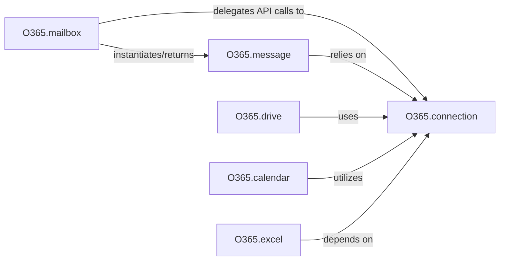

## Details

The `O365 Service Modules` subsystem encompasses a collection of high-level interfaces, each dedicated to encapsulating operations for a specific Microsoft 365 service. These modules provide a user-friendly abstraction over direct API calls to the Microsoft Graph API.

### O365.connection
This component serves as the foundational API Client/Connection Layer. It is responsible for centralized HTTP request handling, authentication (OAuth 2.0), and error management for all communication with the Microsoft Graph API.

**Related Classes/Methods**:

- <a href="https://github.com/O365/python-o365/blob/master/O365/connection.py" target="_blank" rel="noopener noreferrer">`O365.connection`</a>

### O365.mailbox
A resource-specific service module that provides a high-level interface for managing email-related operations and mailbox settings within Microsoft 365.

**Related Classes/Methods**:

- <a href="https://github.com/O365/python-o365/blob/master/O365/mailbox.py" target="_blank" rel="noopener noreferrer">`O365.mailbox`</a>

### O365.message
A resource-specific service module that encapsulates the properties and behaviors of an individual email message, including content, recipients, and attachments.

**Related Classes/Methods**:

- <a href="https://github.com/O365/python-o365/blob/master/O365/message.py" target="_blank" rel="noopener noreferrer">`O365.message`</a>

### O365.drive
A resource-specific service module that offers functionalities for managing files and folders within OneDrive or SharePoint, including reading, writing, copying, and permission management.

**Related Classes/Methods**:

- <a href="https://github.com/O365/python-o365/blob/master/O365/drive.py" target="_blank" rel="noopener noreferrer">`O365.drive`</a>

### O365.calendar
A resource-specific service module that facilitates the creation, retrieval, update, and deletion of calendar events and appointments.

**Related Classes/Methods**:

- <a href="https://github.com/O365/python-o365/blob/master/O365/calendar.py" target="_blank" rel="noopener noreferrer">`O365.calendar`</a>

### O365.excel
A resource-specific service module that provides an interface to interact with Excel workbooks, sheets, and ranges, enabling data manipulation and formatting.

**Related Classes/Methods**:

- <a href="https://github.com/O365/python-o365/blob/master/O365/excel.py" target="_blank" rel="noopener noreferrer">`O365.excel`</a>

### [FAQ](https://github.com/CodeBoarding/GeneratedOnBoardings/tree/main?tab=readme-ov-file#faq)