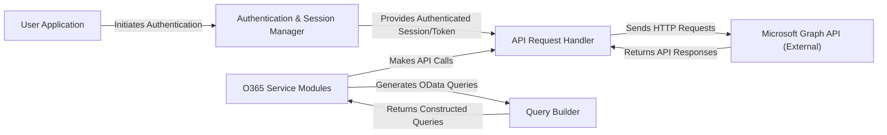

## Details

The `python-o365` library acts as an intermediary between a `User Application` and the `Microsoft Graph API (External)`. The `User Application` initiates interactions, primarily through the `Authentication & Session Manager` to establish a secure session. Once authenticated, the `API Request Handler` facilitates all communication with the `Microsoft Graph API (External)`, abstracting the underlying HTTP requests. High-level `O365 Service Modules` provide user-friendly interfaces for specific Microsoft 365 services, often leveraging the `Query Builder` to construct complex OData queries before passing them to the `API Request Handler`. This architecture ensures a clear separation of concerns, with distinct components handling authentication, API communication, service-specific logic, and query construction, all interacting to manage Microsoft 365 data.

### User Application
The external application or script that consumes the `python-o365` library to interact with Microsoft 365 services. As an external entity, it does not have source code within the `python-o365` project itself.

**Related Classes/Methods**: _None_

### Authentication & Session Manager [[Expand]](./Authentication_Session_Manager.md)
Manages the entire OAuth 2.0 authentication lifecycle, including obtaining authorization URLs, requesting and refreshing access tokens, and persisting session tokens. It acts as the gatekeeper for all API interactions.

**Related Classes/Methods**:

- <a href="https://github.com/O365/python-o365/blob/master/O365/account.py" target="_blank" rel="noopener noreferrer">`O365.account`</a>
- <a href="https://github.com/O365/python-o365/blob/master/O365/connection.py" target="_blank" rel="noopener noreferrer">`O365.connection`</a>
- <a href="https://github.com/O365/python-o365/blob/master/O365/utils/token.py" target="_blank" rel="noopener noreferrer">`O365.utils.token`</a>

### API Request Handler [[Expand]](./API_Request_Handler.md)
Provides the foundational HTTP communication layer for interacting with the Microsoft Graph API. It abstracts the underlying `requests` library, integrates with the authentication mechanism, and handles common API request patterns (GET, POST, PUT, PATCH, DELETE).

**Related Classes/Methods**:

- <a href="https://github.com/O365/python-o365/blob/master/O365/connection.py" target="_blank" rel="noopener noreferrer">`O365.connection`</a>

### O365 Service Modules [[Expand]](./O365_Service_Modules.md)
A collection of high-level interfaces, each encapsulating operations for a specific Microsoft 365 service (e.g., Mailbox, Drive, Calendar, Excel). These modules provide a user-friendly abstraction over direct API calls.

**Related Classes/Methods**:

- <a href="https://github.com/O365/python-o365/blob/master/O365/mailbox.py" target="_blank" rel="noopener noreferrer">`O365.mailbox`</a>
- <a href="https://github.com/O365/python-o365/blob/master/O365/message.py" target="_blank" rel="noopener noreferrer">`O365.message`</a>
- <a href="https://github.com/O365/python-o365/blob/master/O365/drive.py" target="_blank" rel="noopener noreferrer">`O365.drive`</a>
- <a href="https://github.com/O365/python-o365/blob/master/O365/calendar.py" target="_blank" rel="noopener noreferrer">`O365.calendar`</a>
- <a href="https://github.com/O365/python-o365/blob/master/O365/excel.py" target="_blank" rel="noopener noreferrer">`O365.excel`</a>

### Query Builder
A utility component responsible for constructing OData-compliant query strings. It provides methods for filtering, selecting, ordering, and expanding data, ensuring proper formatting for Microsoft Graph API requests.

**Related Classes/Methods**:

- <a href="https://github.com/O365/python-o365/blob/master/O365/utils/query.py" target="_blank" rel="noopener noreferrer">`O365.utils.query`</a>

### Microsoft Graph API (External)
The external RESTful API provided by Microsoft that the `python-o365` library interacts with to manage Microsoft 365 data and services. As an external service, it does not have source code within the `python-o365` project.

**Related Classes/Methods**: _None_

### [FAQ](https://github.com/CodeBoarding/GeneratedOnBoardings/tree/main?tab=readme-ov-file#faq)