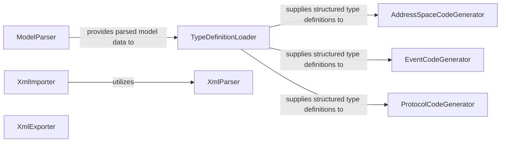

## Details

The `python-opcua` project's schema and common modules form a robust subsystem for managing OPC UA type definitions and address space interactions. The process begins with the `ModelParser`, which ingests OPC UA XML models and transforms them into a structured Python representation. This parsed data is then fed into the `TypeDefinitionLoader`, acting as a central repository for all OPC UA type information. The `TypeDefinitionLoader` is crucial as it supplies the necessary type definitions to various code generators: `AddressSpaceCodeGenerator` for address space elements, `EventCodeGenerator` for event objects, and `ProtocolCodeGenerator` for protocol structures, ensuring consistent code generation across different OPC UA components. Additionally, the system handles XML-based address space operations through the `XmlImporter` and `XmlExporter`, both relying on the foundational `XmlParser` for low-level XML data extraction. This architecture ensures a clear separation of concerns, with dedicated components for parsing, type management, code generation, and XML-based data exchange.

### ModelParser
Parses OPC UA XML models (e.g., NodeSet2 files) into an internal, structured Python representation of OPC UA data types, structs, and enums. It is the initial entry point for processing schema definitions.

**Related Classes/Methods**:

- <a href="https://github.com/FreeOpcUa/python-opcua/blob/master/schemas/generate_model.py" target="_blank" rel="noopener noreferrer">`schemas.generate_model`</a>

### TypeDefinitionLoader
Manages and loads OPC UA type definitions from various sources, including those parsed by `ModelParser`. It acts as a central registry for type information, serving as a foundational data source for all code generation components.

**Related Classes/Methods**:

- <a href="https://github.com/FreeOpcUa/python-opcua/blob/master/opcua/common/type_dictionary_buider.py" target="_blank" rel="noopener noreferrer">`opcua.common.type_dictionary_buider`</a>

### AddressSpaceCodeGenerator
Generates Python code for OPC UA address space elements, including objects, variables, methods, and custom data types, based on the type definitions provided by `TypeDefinitionLoader`.

**Related Classes/Methods**:

- <a href="https://github.com/FreeOpcUa/python-opcua/blob/master/schemas/generate_address_space.py" target="_blank" rel="noopener noreferrer">`schemas.generate_address_space`</a>

### EventCodeGenerator
Specializes in generating Python classes for OPC UA event objects and their associated properties, leveraging the common type definition infrastructure managed by `TypeDefinitionLoader`.

**Related Classes/Methods**:

- <a href="https://github.com/FreeOpcUa/python-opcua/blob/master/schemas/generate_event_objects.py" target="_blank" rel="noopener noreferrer">`schemas.generate_event_objects`</a>

### ProtocolCodeGenerator
Generates Python code for OPC UA protocol structures, specifically focusing on the binary serialization and deserialization logic for enums and structs, using type information from `TypeDefinitionLoader`.

**Related Classes/Methods**:

- <a href="https://github.com/FreeOpcUa/python-opcua/blob/master/schemas/generate_protocol_python.py" target="_blank" rel="noopener noreferrer">`schemas.generate_protocol_python`</a>

### XmlParser
Provides low-level, generic XML parsing capabilities, extracting raw structured data from OPC UA XML documents. It serves as a foundational utility for higher-level XML processing components.

**Related Classes/Methods**:

- <a href="https://github.com/FreeOpcUa/python-opcua/blob/master/opcua/common/xmlparser.py" target="_blank" rel="noopener noreferrer">`opcua.common.xmlparser`</a>

### XmlImporter
Imports OPC UA address space definitions from XML files (e.g., NodeSet2) into the server's live address space or an internal representation. It handles the interpretation and integration of XML-defined nodes.

**Related Classes/Methods**:

- <a href="https://github.com/FreeOpcUa/python-opcua/blob/master/opcua/common/xmlimporter.py" target="_blank" rel="noopener noreferrer">`opcua.common.xmlimporter`</a>

### XmlExporter
Exports the current OPC UA address space nodes or specific node sets into a standardized OPC UA XML format. It is the inverse operation of the `XmlImporter`, facilitating persistence and exchange of address space definitions.

**Related Classes/Methods**:

- <a href="https://github.com/FreeOpcUa/python-opcua/blob/master/opcua/common/xmlexporter.py" target="_blank" rel="noopener noreferrer">`opcua.common.xmlexporter`</a>

### [FAQ](https://github.com/CodeBoarding/GeneratedOnBoardings/tree/main?tab=readme-ov-file#faq)