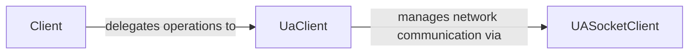

## Details

The OPC UA client subsystem is structured around a clear separation of concerns. The `Client` component provides a user-friendly, high-level API, abstracting the complexities of the OPC UA protocol. It serves as the primary entry point for applications. Beneath this, the `UaClient` component is the core protocol handler, responsible for managing OPC UA service requests, message serialization/deserialization, and asynchronous operations. Critically, the `UaClient` also directly manages the foundational network communication, including TCP/IP connections and secure channel management, effectively integrating the responsibilities that might conceptually be attributed to a "socket client." This architecture ensures that the `Client` focuses on user interaction while the `UaClient` handles the intricate details of the OPC UA protocol and its underlying network transport.

### Client [[Expand]](./Client.md)
This component (`opcua.client.client.Client`) provides the primary, user-facing interface for applications. It offers a simplified API for establishing connections, managing sessions, configuring security, discovering endpoints, and performing common OPC UA operations such as browsing, reading, writing, and method calls on nodes. It acts as an abstraction layer over the intricate details of the OPC UA protocol.

**Related Classes/Methods**:

- <a href="https://github.com/FreeOpcUa/python-opcua/blob/master/opcua/client/client.py#L81-L674" target="_blank" rel="noopener noreferrer">`opcua.client.client.Client`:81-674</a>

### UaClient
This component (`opcua.client.ua_client.UaClient`) serves as the low-level OPC UA protocol handler. It is responsible for directly implementing OPC UA service requests and processing responses as defined by the specification. It manages message serialization and deserialization, handles internal callbacks for asynchronous operations (like subscriptions), and acts as the bridge between the high-level client API and the network communication layer. Crucially, it also handles the foundational network communication, including the establishment and management of raw TCP/IP connections, the direct sending and receiving of OPC UA binary messages over the network, and the management of the secure channel at the transport level.

**Related Classes/Methods**:

- <a href="https://github.com/FreeOpcUa/python-opcua/blob/master/opcua/client/ua_client.py#L238-L677" target="_blank" rel="noopener noreferrer">`opcua.client.ua_client.UaClient`:238-677</a>

### UASocketClient
This component, as a distinct entity with a dedicated source file at `opcua/client/network.py`, could not be located. Its described responsibilities for foundational network communication (TCP/IP connections, message sending/receiving, secure channel management) are integrated into the `UaClient` component, which acts as the primary handler for the network communication layer. This component is therefore considered a conceptual representation of network handling within the `UaClient`'s scope.

**Related Classes/Methods**: _None_

### [FAQ](https://github.com/CodeBoarding/GeneratedOnBoardings/tree/main?tab=readme-ov-file#faq)