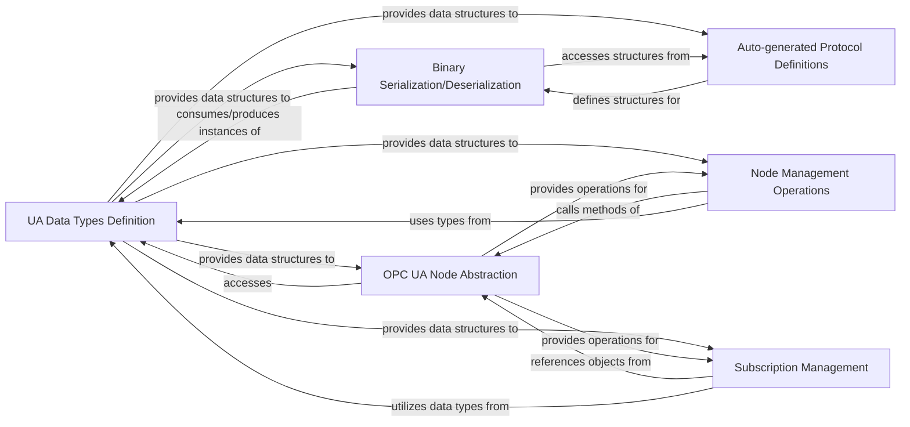

## Details

The `OPC UA Protocol Core` subsystem forms the bedrock of the `python-opcua` library, encapsulating the fundamental elements required for OPC UA communication. Its boundaries are defined by the core OPC UA data type definitions, binary encoding/decoding mechanisms, auto-generated protocol structures, and common high-level abstractions for interacting with the OPC UA address space.

### UA Data Types Definition
Defines the fundamental OPC UA data types (e.g., NodeId, Variant, StatusCode, QualifiedName) that serve as the basic building blocks for all OPC UA communication and data representation.

**Related Classes/Methods**:

- <a href="https://github.com/FreeOpcUa/python-opcua/blob/master/opcua/ua/uatypes.py" target="_blank" rel="noopener noreferrer">`opcua.ua.uatypes`</a>

### Binary Serialization/Deserialization
Handles the conversion of complex OPC UA structures and messages to and from their binary wire format, enabling low-level communication over the network.

**Related Classes/Methods**:

- <a href="https://github.com/FreeOpcUa/python-opcua/blob/master/opcua/ua/ua_binary.py" target="_blank" rel="noopener noreferrer">`opcua.ua.ua_binary`</a>

### Auto-generated Protocol Definitions
Provides structured, high-level Python representations of OPC UA services (requests, responses) and complex data types, often generated from the OPC UA XML specifications. This component is crucial for protocol compliance and maintainability.

**Related Classes/Methods**:

- <a href="https://github.com/FreeOpcUa/python-opcua/blob/master/opcua/ua/uaprotocol_auto.py" target="_blank" rel="noopener noreferrer">`opcua.ua.uaprotocol_auto`</a>

### OPC UA Node Abstraction
Offers a high-level, object-oriented interface for interacting with individual OPC UA nodes within the address space, abstracting away the underlying protocol details for node attribute access.

**Related Classes/Methods**:

- <a href="https://github.com/FreeOpcUa/python-opcua/blob/master/opcua/common/node.py" target="_blank" rel="noopener noreferrer">`opcua.common.node`</a>

### Node Management Operations
Simplifies common address space manipulation tasks, such as adding folders, objects, or variables to the OPC UA server's address space.

**Related Classes/Methods**:

- <a href="https://github.com/FreeOpcUa/python-opcua/blob/master/opcua/common/manage_nodes.py" target="_blank" rel="noopener noreferrer">`opcua.common.manage_nodes`</a>

### Subscription Management
Manages client-side OPC UA subscriptions, handling the creation, modification, and deletion of monitored items and dispatching data change notifications.

**Related Classes/Methods**:

- <a href="https://github.com/FreeOpcUa/python-opcua/blob/master/opcua/common/subscription.py" target="_blank" rel="noopener noreferrer">`opcua.common.subscription`</a>

### [FAQ](https://github.com/CodeBoarding/GeneratedOnBoardings/tree/main?tab=readme-ov-file#faq)