```mermaid
graph LR
    opcua_server_server_Server["opcua.server.server.Server"]
    opcua_server_internal_server_InternalServer["opcua.server.internal_server.InternalServer"]
    opcua_server_address_space_AddressSpace["opcua.server.address_space.AddressSpace"]
    opcua_server_internal_subscription_InternalSubscription["opcua.server.internal_subscription.InternalSubscription"]
    opcua_server_history_HistoryManager["opcua.server.history.HistoryManager"]
    opcua_server_server_Server -- "Orchestrates" --> opcua_server_history_HistoryManager
    opcua_server_server_Server -- "Accesses and Manipulates" --> opcua_server_address_space_AddressSpace
    opcua_server_internal_server_InternalServer -- "Initializes and Relies On" --> opcua_server_address_space_AddressSpace
    opcua_server_internal_server_InternalServer -- "Manages Subscriptions Via" --> opcua_server_internal_subscription_InternalSubscription
    opcua_server_address_space_AddressSpace -- "Initialized and Relied On By" --> opcua_server_internal_server_InternalServer
    opcua_server_address_space_AddressSpace -- "Accessed and Manipulated By" --> opcua_server_server_Server
    opcua_server_internal_subscription_InternalSubscription -- "Managed By" --> opcua_server_internal_server_InternalServer
    opcua_server_internal_subscription_InternalSubscription -- "Publishes Notifications To" --> opcua_server_history_HistoryManager
    opcua_server_history_HistoryManager -- "Orchestrated By" --> opcua_server_server_Server
    opcua_server_history_HistoryManager -- "Subscribes to Notifications From" --> opcua_server_internal_subscription_InternalSubscription
```

## Details

The `OPC UA Server` subsystem is responsible for managing the OPC UA server's lifecycle, exposing the OPC UA information model (address space), and processing incoming client requests, subscriptions, and historical data. Its boundaries are defined by the core server-side functionalities implemented in `opcua/server/server.py`, `opcua/server/internal_server.py`, `opcua/server/address_space.py`, `opcua/server/internal_subscription.py`, and `opcua/server/history.py`.

### opcua.server.server.Server
This component provides the public API for the OPC UA server, serving as the primary entry point for users to instantiate and control a server instance. It manages the server's lifecycle (start/stop), configuration, user management, and discovery services.

**Related Classes/Methods**:

- <a href="https://github.com/FreeOpcUa/python-opcua/blob/master/opcua/server/server.py#L37-L641" target="_blank" rel="noopener noreferrer">`opcua.server.server.Server`:37-641</a>

### opcua.server.internal_server.InternalServer
Manages the internal operational aspects and state of the server. This includes loading the standard address space, applying necessary fixes, and handling the lifecycle of client sessions. It acts as the core orchestrator for internal server processes, abstracting away the complexities of the OPC UA protocol stack from the public `Server` component.

**Related Classes/Methods**:

- <a href="https://github.com/FreeOpcUa/python-opcua/blob/master/opcua/server/internal_server.py#L40-L285" target="_blank" rel="noopener noreferrer">`opcua.server.internal_server.InternalServer`:40-285</a>

### opcua.server.address_space.AddressSpace
This is the foundational component for managing the OPC UA information model. It provides functionalities for browsing nodes, translating browse paths, and performing CRUD (Create, Read, Update, Delete) operations on nodes and references within the information model. It represents the server's data and object hierarchy.

**Related Classes/Methods**:

- <a href="https://github.com/FreeOpcUa/python-opcua/blob/master/opcua/server/address_space.py#L493-L711" target="_blank" rel="noopener noreferrer">`opcua.server.address_space.AddressSpace`:493-711</a>

### opcua.server.internal_subscription.InternalSubscription
Manages OPC UA subscriptions and monitored items. It handles the creation, modification, and deletion of subscriptions, and is responsible for publishing notifications to clients when data changes or events occur. This component is vital for real-time data monitoring.

**Related Classes/Methods**:

- <a href="https://github.com/FreeOpcUa/python-opcua/blob/master/opcua/server/internal_subscription.py#L248-L400" target="_blank" rel="noopener noreferrer">`opcua.server.internal_subscription.InternalSubscription`:248-400</a>

### opcua.server.history.HistoryManager
Provides functionalities for historizing data changes and events. It captures, stores, and manages historical values and event data, making them available for retrieval by OPC UA clients. This component enables historical data access services.

**Related Classes/Methods**:

- <a href="https://github.com/FreeOpcUa/python-opcua/blob/master/opcua/server/history.py#L186-L348" target="_blank" rel="noopener noreferrer">`opcua.server.history.HistoryManager`:186-348</a>

### [FAQ](https://github.com/CodeBoarding/GeneratedOnBoardings/tree/main?tab=readme-ov-file#faq)