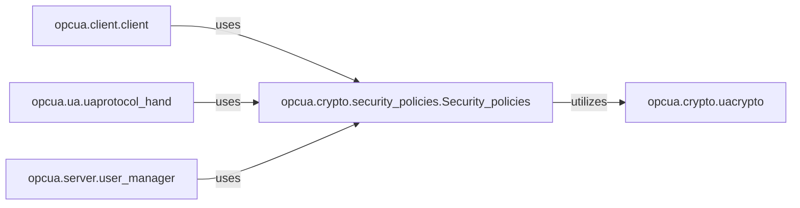

## Details

The opcua.crypto subsystem is central to securing OPC UA communications, providing a robust framework for data confidentiality, integrity, and authentication. It comprises opcua.crypto.uacrypto, which offers core cryptographic primitives, and opcua.crypto.security_policies.Security_policies, which defines and enforces OPC UA-specific security protocols by orchestrating uacrypto's capabilities. This subsystem is critically integrated into the broader OPC UA architecture, with key modules such as opcua.client.client, opcua.ua.uaprotocol_hand, and opcua.server.user_manager directly interacting with opcua.crypto.security_policies.Security_policies to ensure secure client authentication, protocol handshakes, and server-side user token validation, thereby safeguarding the entire communication flow.

### opcua.crypto.uacrypto
Offers a suite of low-level cryptographic primitives, including functions for encryption, decryption, signing, and hashing.

**Related Classes/Methods**: _None_

### opcua.crypto.security_policies.Security_policies
Orchestrates cryptographic primitives to implement specific OPC UA security policies, defining how messages are secured.

**Related Classes/Methods**: _None_

### opcua.client.client
Responsible for client-side operations and applying security measures.

**Related Classes/Methods**: _None_

### opcua.ua.uaprotocol_hand
Handles the establishment of secure OPC UA connections and negotiates security parameters.

**Related Classes/Methods**: _None_

### opcua.server.user_manager
Manages server-side user authentication and validates incoming user tokens.

**Related Classes/Methods**: _None_

### [FAQ](https://github.com/CodeBoarding/GeneratedOnBoardings/tree/main?tab=readme-ov-file#faq)