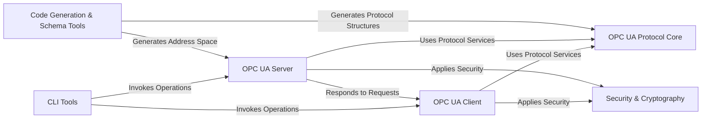

## Details

The `python-opcua` project provides a comprehensive implementation of the OPC UA standard, enabling both client and server functionalities. At its core, the **OPC UA Protocol Core** handles the fundamental aspects of OPC UA communication, including data types, serialization, and messaging. Building upon this, the **OPC UA Client** and **OPC UA Server** components offer high-level interfaces for applications to interact with OPC UA networks. Security is a paramount concern, addressed by the **Security & Cryptography** component, which ensures secure and authenticated communication. For development and automation, **CLI Tools** provide direct access to client and server functionalities, while **Code Generation & Schema Tools** assist in generating necessary code from OPC UA schemas, streamlining the development of OPC UA applications. This modular design facilitates clear separation of concerns, making the project maintainable and extensible, and provides a clear flow for data and control within an OPC UA ecosystem.

### OPC UA Client [[Expand]](./OPC_UA_Client.md)
The primary interface for applications to connect, interact, and consume services from OPC UA servers. It handles session management, browsing, reading, writing, and method calls.

**Related Classes/Methods**:

- <a href="https://github.com/FreeOpcUa/python-opcua/blob/master/opcua/client/client.py" target="_blank" rel="noopener noreferrer">`opcua/client/client.py`</a>
- <a href="https://github.com/FreeOpcUa/python-opcua/blob/master/opcua/client/ua_client.py" target="_blank" rel="noopener noreferrer">`opcua/client/ua_client.py`</a>

### OPC UA Server [[Expand]](./OPC_UA_Server.md)
Manages the OPC UA server's lifecycle, exposes the OPC UA information model (address space), and processes incoming client requests, subscriptions, and historical data.

**Related Classes/Methods**:

- <a href="https://github.com/FreeOpcUa/python-opcua/blob/master/opcua/server/server.py" target="_blank" rel="noopener noreferrer">`opcua/server/server.py`</a>
- <a href="https://github.com/FreeOpcUa/python-opcua/blob/master/opcua/server/internal_server.py" target="_blank" rel="noopener noreferrer">`opcua/server/internal_server.py`</a>
- <a href="https://github.com/FreeOpcUa/python-opcua/blob/master/opcua/server/address_space.py" target="_blank" rel="noopener noreferrer">`opcua/server/address_space.py`</a>
- <a href="https://github.com/FreeOpcUa/python-opcua/blob/master/opcua/server/internal_subscription.py" target="_blank" rel="noopener noreferrer">`opcua/server/internal_subscription.py`</a>
- <a href="https://github.com/FreeOpcUa/python-opcua/blob/master/opcua/server/history.py" target="_blank" rel="noopener noreferrer">`opcua/server/history.py`</a>

### OPC UA Protocol Core [[Expand]](./OPC_UA_Protocol_Core.md)
This foundational layer defines the core OPC UA data types, handles their binary serialization and deserialization, and implements the low-level OPC UA messaging and transport mechanisms. It also includes common abstractions like node objects and service definitions.

**Related Classes/Methods**:

- <a href="https://github.com/FreeOpcUa/python-opcua/blob/master/opcua/ua/uatypes.py" target="_blank" rel="noopener noreferrer">`opcua/ua/uatypes.py`</a>
- <a href="https://github.com/FreeOpcUa/python-opcua/blob/master/opcua/ua/ua_binary.py" target="_blank" rel="noopener noreferrer">`opcua/ua/ua_binary.py`</a>
- <a href="https://github.com/FreeOpcUa/python-opcua/blob/master/opcua/ua/uaprotocol_auto.py" target="_blank" rel="noopener noreferrer">`opcua/ua/uaprotocol_auto.py`</a>
- <a href="https://github.com/FreeOpcUa/python-opcua/blob/master/opcua/common/node.py" target="_blank" rel="noopener noreferrer">`opcua/common/node.py`</a>
- <a href="https://github.com/FreeOpcUa/python-opcua/blob/master/opcua/common/subscription.py" target="_blank" rel="noopener noreferrer">`opcua/common/subscription.py`</a>
- <a href="https://github.com/FreeOpcUa/python-opcua/blob/master/opcua/common/manage_nodes.py" target="_blank" rel="noopener noreferrer">`opcua/common/manage_nodes.py`</a>

### Security & Cryptography [[Expand]](./Security_Cryptography.md)
Provides cryptographic functions and implements OPC UA security policies for secure communication, including certificate management, encryption, and signing.

**Related Classes/Methods**:

- <a href="https://github.com/FreeOpcUa/python-opcua/blob/master/opcua/crypto/uacrypto.py" target="_blank" rel="noopener noreferrer">`opcua/crypto/uacrypto.py`</a>
- <a href="https://github.com/FreeOpcUa/python-opcua/blob/master/opcua/crypto/security_policies.py" target="_blank" rel="noopener noreferrer">`opcua/crypto/security_policies.py`</a>

### Code Generation & Schema Tools [[Expand]](./Code_Generation_Schema_Tools.md)
A development-time component responsible for generating Python code for OPC UA address space, data types, and protocol structures from XML schemas. It also includes tools for XML import/export of address space definitions.

**Related Classes/Methods**:

- <a href="https://github.com/FreeOpcUa/python-opcua/blob/master/schemas/generate_address_space.py" target="_blank" rel="noopener noreferrer">`schemas.generate_address_space.py`</a>
- <a href="https://github.com/FreeOpcUa/python-opcua/blob/master/schemas/generate_event_objects.py" target="_blank" rel="noopener noreferrer">`schemas/generate_event_objects.py`</a>
- <a href="https://github.com/FreeOpcUa/python-opcua/blob/master/schemas/generate_model.py" target="_blank" rel="noopener noreferrer">`schemas/generate_model.py`</a>
- <a href="https://github.com/FreeOpcUa/python-opcua/blob/master/schemas/generate_protocol_python.py" target="_blank" rel="noopener noreferrer">`schemas/generate_protocol_python.py`</a>
- <a href="https://github.com/FreeOpcUa/python-opcua/blob/master/opcua/common/xmlexporter.py" target="_blank" rel="noopener noreferrer">`opcua/common/xmlexporter.py`</a>
- <a href="https://github.com/FreeOpcUa/python-opcua/blob/master/opcua/common/xmlimporter.py" target="_blank" rel="noopener noreferrer">`opcua/common/xmlimporter.py`</a>
- <a href="https://github.com/FreeOpcUa/python-opcua/blob/master/opcua/common/xmlparser.py" target="_blank" rel="noopener noreferrer">`opcua/common/xmlparser.py`</a>

### CLI Tools
Command-line utilities that leverage the core OPC UA Client and Server functionalities for testing, debugging, and automation.

**Related Classes/Methods**:

- <a href="https://github.com/FreeOpcUa/python-opcua/blob/master/opcua/tools/uacall" target="_blank" rel="noopener noreferrer">`/mnt/e/StartUp/python-opcua/opcua/tools/uacall`</a>
- <a href="https://github.com/FreeOpcUa/python-opcua/blob/master/opcua/tools/uaclient" target="_blank" rel="noopener noreferrer">`/mnt/e/StartUp/python-opcua/opcua/tools/uaclient`</a>
- <a href="https://github.com/FreeOpcUa/python-opcua/blob/master/opcua/tools/uadiscover" target="_blank" rel="noopener noreferrer">`/mnt/e/StartUp/python-opcua/opcua/tools/uadiscover`</a>
- <a href="https://github.com/FreeOpcUa/python-opcua/blob/master/opcua/tools/uahistoryread" target="_blank" rel="noopener noreferrer">`/mnt/e/StartUp/python-opcua/opcua/tools/uahistoryread`</a>
- <a href="https://github.com/FreeOpcUa/python-opcua/blob/master/opcua/tools/uals" target="_blank" rel="noopener noreferrer">`/mnt/e/StartUp/python-opcua/opcua/tools/uals`</a>
- <a href="https://github.com/FreeOpcUa/python-opcua/blob/master/opcua/tools/uaread" target="_blank" rel="noopener noreferrer">`/mnt/e/StartUp/python-opcua/opcua/tools/uaread`</a>
- <a href="https://github.com/FreeOpcUa/python-opcua/blob/master/opcua/tools/uaserver" target="_blank" rel="noopener noreferrer">`/mnt/e/StartUp/python-opcua/opcua/tools/uaserver`</a>
- <a href="https://github.com/FreeOpcUa/python-opcua/blob/master/opcua/tools/uasubscribe" target="_blank" rel="noopener noreferrer">`/mnt/e/StartUp/python-opcua/opcua/tools/uasubscribe`</a>
- <a href="https://github.com/FreeOpcUa/python-opcua/blob/master/opcua/tools/uawrite" target="_blank" rel="noopener noreferrer">`/mnt/e/StartUp/python-opcua/opcua/tools/uawrite`</a>

### [FAQ](https://github.com/CodeBoarding/GeneratedOnBoardings/tree/main?tab=readme-ov-file#faq)