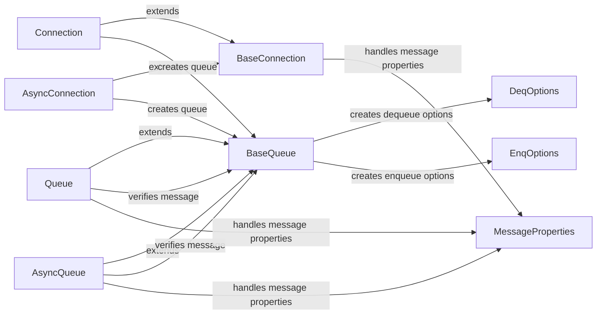

## Component Details

### BaseConnection
Represents the base class for database connections, providing fundamental functionalities such as connection verification and transaction management. It serves as an abstract layer for both synchronous and asynchronous connections, defining common interfaces and functionalities.
- **Related Classes/Methods**: `repos.python-oracledb.src.oracledb.connection.BaseConnection`

### Connection
Represents a synchronous connection to the Oracle database, extending BaseConnection with specific implementations for creating queues, committing, and rolling back transactions. It handles the establishment and management of a standard database session, providing a blocking interface for database interactions.
- **Related Classes/Methods**: `repos.python-oracledb.src.oracledb.connection.Connection`

### AsyncConnection
Represents an asynchronous connection to the Oracle database, extending BaseConnection to support non-blocking operations. It is designed for use with asyncio, enabling asynchronous queue creation, transaction handling, and other database interactions, providing a non-blocking interface for enhanced concurrency.
- **Related Classes/Methods**: `repos.python-oracledb.src.oracledb.connection.AsyncConnection`

### BaseQueue
Represents the base class for Oracle AQ queues, defining common methods for enqueueing and dequeueing messages, as well as message verification. It provides a foundation for both synchronous and asynchronous queue implementations, establishing a common interface for queue operations.
- **Related Classes/Methods**: `repos.python-oracledb.src.oracledb.aq.BaseQueue`

### Queue
Represents a synchronous Oracle AQ queue, extending BaseQueue with methods for enqueueing and dequeueing single and multiple messages. It provides a standard interface for interacting with Oracle AQ in a blocking manner, suitable for traditional synchronous applications.
- **Related Classes/Methods**: `repos.python-oracledb.src.oracledb.aq.Queue`

### AsyncQueue
Represents an asynchronous Oracle AQ queue, extending BaseQueue with asynchronous methods for enqueueing and dequeueing messages. It is designed for use with asyncio, enabling non-blocking queue operations, ideal for modern asynchronous applications.
- **Related Classes/Methods**: `repos.python-oracledb.src.oracledb.aq.AsyncQueue`

### MessageProperties
Represents the properties of a message in an Oracle AQ queue, including correlation, delay, expiration, and payload. It encapsulates the metadata associated with a message, facilitating message customization and control, allowing fine-tuning of message delivery and behavior.
- **Related Classes/Methods**: `repos.python-oracledb.src.oracledb.aq.MessageProperties`

### EnqOptions
Represents the enqueue options for an Oracle AQ queue, such as delivery mode and transformation. It allows customization of the enqueue operation, influencing message persistence and transformation behavior, enabling control over how messages are added to the queue.
- **Related Classes/Methods**: `repos.python-oracledb.src.oracledb.aq.EnqOptions`

### DeqOptions
Represents the dequeue options for an Oracle AQ queue, including condition, consumer name, and navigation. It enables fine-grained control over the dequeue operation, allowing selective message retrieval based on specific criteria, providing flexibility in how messages are retrieved from the queue.
- **Related Classes/Methods**: `repos.python-oracledb.src.oracledb.aq.DeqOptions`
