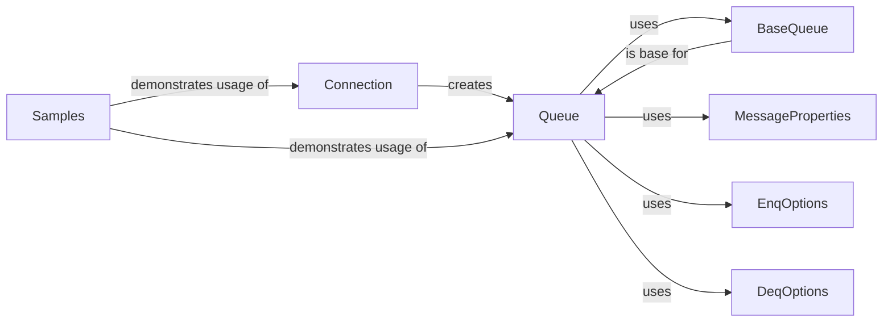

## Component Details

The Advanced Queuing (AQ) component in python-oracledb provides a mechanism for asynchronous communication with Oracle databases. It allows applications to enqueue and dequeue messages, enabling decoupled interactions between different parts of a system. The core functionality revolves around establishing a connection, creating and managing queues, and sending/receiving messages with customizable properties and options. The samples demonstrate various use cases of the AQ functionality, including bulk operations and handling different data types.

### Connection
The Connection component is responsible for establishing a connection to the Oracle database. It provides the entry point for creating and accessing queues. It initializes the necessary resources for interacting with the database's AQ functionality.
- **Related Classes/Methods**: `python-oracledb.src.oracledb.connection.Connection`, `python-oracledb.src.oracledb.connection.AsyncConnection`

### Queue
The Queue component represents an Oracle Advanced Queuing (AQ) queue. It provides methods for enqueueing (enq) and dequeueing (deq) messages, both individually and in batches. It interacts with the database through the connection to perform these operations, utilizing message properties and options for customization.
- **Related Classes/Methods**: `python-oracledb.src.oracledb.aq.Queue`, `python-oracledb.src.oracledb.aq.AsyncQueue`

### BaseQueue
The BaseQueue component serves as a base class for Queue and AsyncQueue, providing common functionality and attributes related to queue operations. It encapsulates the shared logic for creating queue objects and managing their basic properties.
- **Related Classes/Methods**: `python-oracledb.src.oracledb.aq.BaseQueue`

### MessageProperties
The MessageProperties component encapsulates the properties of a message being enqueued or dequeued, such as correlation ID, delay, expiration, and priority. It allows users to customize message attributes to control message delivery and processing.
- **Related Classes/Methods**: `python-oracledb.src.oracledb.aq.MessageProperties`

### EnqOptions
The EnqOptions component provides options for enqueueing messages, such as visibility and delivery mode. It allows users to control how messages are enqueued into the queue, influencing their immediate availability and persistence.
- **Related Classes/Methods**: `python-oracledb.src.oracledb.aq.EnqOptions`

### DeqOptions
The DeqOptions component provides options for dequeueing messages, such as navigation, wait time, and mode. It allows users to control how messages are dequeued from the queue, influencing the selection and retrieval process.
- **Related Classes/Methods**: `python-oracledb.src.oracledb.aq.DeqOptions`

### Samples
The Samples component demonstrates how to use the AQ functionality in different scenarios, including bulk operations, raw data handling, object payloads, and multi-consumer setups. They provide practical examples of how to interact with the Queue and AsyncQueue classes, showcasing the various features and capabilities of the AQ component.
- **Related Classes/Methods**: `python-oracledb.samples.bulk_aq_async`, `python-oracledb.samples.raw_aq_async`, `python-oracledb.samples.object_aq_async`, `python-oracledb.samples.multi_consumer_aq_async`
