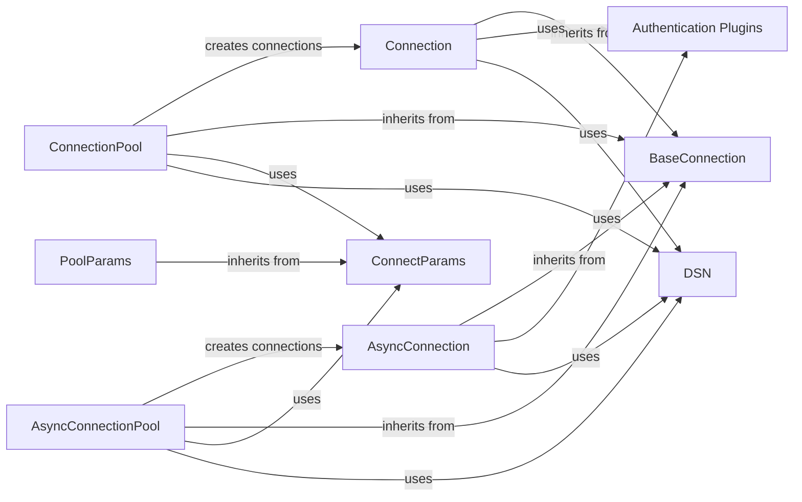

## Component Details

### BaseConnection
Abstract base class for connection objects, providing common functionality like verifying connection status and managing attributes. It serves as a foundation for both synchronous and asynchronous connections, defining the basic interface for interacting with the Oracle database.
- **Related Classes/Methods**: `repos.python-oracledb.src.oracledb.connection.BaseConnection`

### Connection
Represents a synchronous connection to an Oracle database. It inherits from BaseConnection and provides methods for executing SQL statements, managing transactions, interacting with database objects, and managing database sessions. It uses Cursor objects to execute queries, providing a way to interact with the database in a synchronous manner.
- **Related Classes/Methods**: `repos.python-oracledb.src.oracledb.connection.Connection`

### AsyncConnection
Represents an asynchronous connection to an Oracle database. It inherits from BaseConnection and provides asynchronous methods for executing SQL statements, managing transactions, and interacting with database objects. It uses AsyncCursor objects to execute queries, enabling non-blocking database operations.
- **Related Classes/Methods**: `repos.python-oracledb.src.oracledb.connection.AsyncConnection`

### ConnectionPool
Represents a connection pool for synchronous operations, which manages a set of database connections to improve performance. It creates and manages Connection objects, reducing the overhead of establishing new connections for each database operation.
- **Related Classes/Methods**: `repos.python-oracledb.src.oracledb.pool.ConnectionPool`

### AsyncConnectionPool
Represents an asynchronous connection pool, which manages a set of asynchronous database connections to improve performance. It creates and manages AsyncConnection objects, providing efficient asynchronous database access.
- **Related Classes/Methods**: `repos.python-oracledb.src.oracledb.pool.AsyncConnectionPool`

### ConnectParams
Represents the parameters used to establish a connection to the Oracle database, such as username, password, and connection string. It encapsulates the necessary information for creating a database connection.
- **Related Classes/Methods**: `repos.python-oracledb.src.oracledb.connect_params.ConnectParams`

### PoolParams
Represents the parameters used to configure a connection pool, such as the minimum and maximum number of connections. It allows customization of the connection pool's behavior.
- **Related Classes/Methods**: `repos.python-oracledb.src.oracledb.pool_params.PoolParams`

### Authentication Plugins
Handles authentication with cloud providers (Azure, OCI) to obtain tokens for database connections. It provides secure authentication mechanisms for accessing Oracle databases in cloud environments.
- **Related Classes/Methods**: `repos.python-oracledb.src.oracledb.plugins.azure_tokens`, `repos.python-oracledb.src.oracledb.plugins.oci_tokens`, `repos.python-oracledb.src.oracledb.plugins.oci_config_provider`, `repos.python-oracledb.src.oracledb.plugins.azure_config_provider`

### DSN
Handles the generation and parsing of Data Source Names (DSNs) for Oracle database connections. It simplifies the process of specifying connection parameters.
- **Related Classes/Methods**: `repos.python-oracledb.src.oracledb.dsn`
