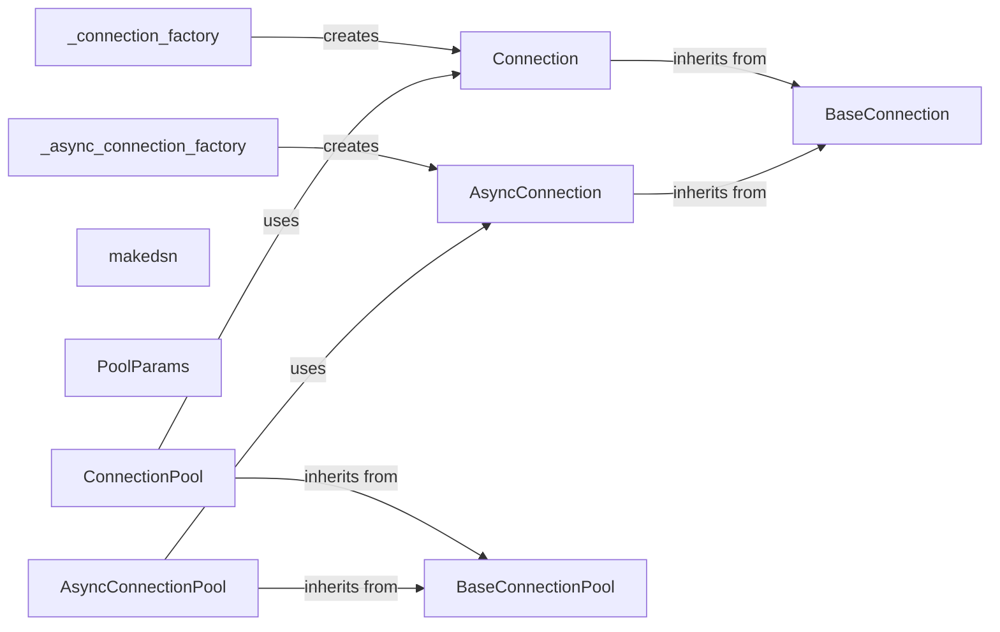

## Component Details

The Connection Management component in python-oracledb is responsible for establishing and managing connections to Oracle databases. It provides both synchronous and asynchronous connection options, along with connection pooling for efficient resource management. The core functionality revolves around creating connections, executing SQL statements, managing transactions, and handling connection-related attributes. It uses factory functions to create connection and pool objects.

### BaseConnection
The BaseConnection class serves as the foundation for both synchronous and asynchronous connections. It defines common attributes and methods related to connection management, such as setting autocommit, call timeout, and client identifier. It provides a consistent interface for connection-related operations.
- **Related Classes/Methods**: `python-oracledb.src.oracledb.connection.BaseConnection`, `python-oracledb.utils.templates.connection.BaseConnection`

### Connection
The Connection class represents a synchronous connection to the Oracle database. It inherits from BaseConnection and provides methods for executing SQL statements, committing or rolling back transactions, creating cursors, and interacting with LOBs and SODA databases. It enables synchronous database operations.
- **Related Classes/Methods**: `python-oracledb.src.oracledb.connection.Connection`, `python-oracledb.utils.templates.connection.Connection`

### AsyncConnection
The AsyncConnection class represents an asynchronous connection to the Oracle database. It inherits from BaseConnection and provides asynchronous methods for executing SQL statements, committing or rolling back transactions, creating cursors, and other database operations. It enables asynchronous database operations.
- **Related Classes/Methods**: `python-oracledb.src.oracledb.connection.AsyncConnection`, `python-oracledb.utils.templates.connection.AsyncConnection`

### BaseConnectionPool
The BaseConnectionPool class serves as the base for connection pools, managing a group of connections. It defines attributes and methods for managing the pool, such as setting minimum and maximum pool size, connection timeout, and other pool-related parameters. It provides a foundation for connection pooling functionality.
- **Related Classes/Methods**: `python-oracledb.src.oracledb.pool.BaseConnectionPool`, `python-oracledb.utils.templates.pool.BaseConnectionPool`

### ConnectionPool
The ConnectionPool class represents a synchronous connection pool. It inherits from BaseConnectionPool and provides methods for acquiring and releasing connections from the pool. It manages a pool of synchronous connections for efficient reuse.
- **Related Classes/Methods**: `python-oracledb.src.oracledb.pool.ConnectionPool`, `python-oracledb.utils.templates.pool.ConnectionPool`

### AsyncConnectionPool
The AsyncConnectionPool class represents an asynchronous connection pool. It inherits from BaseConnectionPool and provides asynchronous methods for acquiring and releasing connections from the pool. It manages a pool of asynchronous connections for efficient reuse.
- **Related Classes/Methods**: `python-oracledb.src.oracledb.pool.AsyncConnectionPool`, `python-oracledb.utils.templates.pool.AsyncConnectionPool`

### makedsn
The `makedsn` function constructs a Data Source Name (DSN) string from its components (host, port, service name). This DSN is used to establish a connection to the Oracle database.
- **Related Classes/Methods**: `python-oracledb.src.oracledb.dsn`

### PoolParams
The PoolParams class encapsulates the parameters for creating a connection pool, such as the minimum and maximum number of connections, connection timeout, and other pool-related settings. It provides a way to configure the connection pool.
- **Related Classes/Methods**: `python-oracledb.src.oracledb.pool_params`

### _connection_factory
The `_connection_factory` function is a factory function responsible for creating Connection objects. It encapsulates the logic for instantiating and configuring synchronous connections.
- **Related Classes/Methods**: `python-oracledb.src.oracledb.connection`

### _async_connection_factory
The `_async_connection_factory` function is a factory function responsible for creating AsyncConnection objects. It encapsulates the logic for instantiating and configuring asynchronous connections.
- **Related Classes/Methods**: `python-oracledb.src.oracledb.connection`
