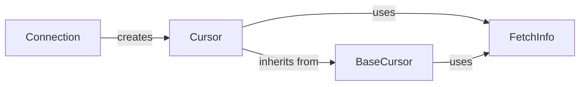

## Component Details

### Connection
The Connection component represents a connection to the Oracle database. It's responsible for establishing and managing the connection, creating cursors, executing SQL statements, and managing transactions. It acts as the entry point for interacting with the database.
- **Related Classes/Methods**: `repos.python-oracledb.src.oracledb.connection.Connection`, `repos.python-oracledb.utils.templates.connection.Connection`, `repos.python-oracledb.src.oracledb.connection.AsyncConnection`

### Cursor
The Cursor component is responsible for executing SQL statements and PL/SQL blocks, fetching results, and managing cursor attributes. It provides the core functionality for interacting with the database and retrieving data. It uses FetchInfo to manage data fetching details.
- **Related Classes/Methods**: `repos.python-oracledb.src.oracledb.cursor.Cursor`, `repos.python-oracledb.src.oracledb.cursor.AsyncCursor`

### BaseCursor
The BaseCursor component provides the base functionality for both synchronous and asynchronous cursors. It includes methods for verifying the cursor state, preparing statements, and managing attributes. It serves as an abstract class for Cursor and AsyncCursor.
- **Related Classes/Methods**: `repos.python-oracledb.src.oracledb.cursor.BaseCursor`

### FetchInfo
The FetchInfo component is responsible for managing information about fetching data from the database, such as column types and sizes. It is used by the Cursor and BaseCursor to handle data retrieval efficiently.
- **Related Classes/Methods**: `repos.python-oracledb.src.oracledb.fetch_info.FetchInfo`
