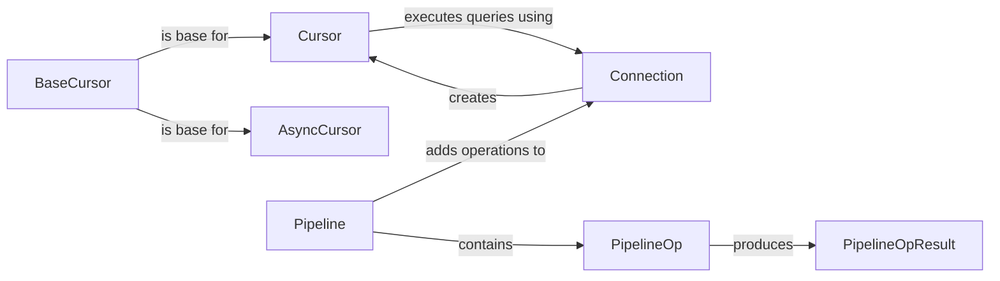

## Component Details

The Cursor and Execution Management component is responsible for handling the execution of SQL queries and PL/SQL blocks within the oracledb library. It provides the necessary tools for creating cursors, binding parameters, executing statements, fetching results, and managing cursor attributes. This component supports both synchronous and asynchronous operations, as well as pipeline operations for improved performance. The central classes involved are BaseCursor, Cursor, AsyncCursor, Pipeline, PipelineOp, and PipelineOpResult, which work together to provide a comprehensive solution for interacting with the Oracle database.

### BaseCursor
The BaseCursor class serves as an abstract base class for Cursor objects, providing common functionalities and attributes. It handles basic cursor operations and attribute management, such as binding parameters and managing cursor state. It is not directly instantiated but provides the foundation for synchronous and asynchronous cursor implementations.
- **Related Classes/Methods**: `oracledb.cursor.BaseCursor`

### Cursor
The Cursor class extends BaseCursor to provide synchronous execution capabilities. It allows users to execute SQL statements, fetch results, and manage cursor attributes in a blocking manner. It interacts with the Connection object to send requests to the database and receive responses.
- **Related Classes/Methods**: `oracledb.cursor.Cursor`

### AsyncCursor
The AsyncCursor class extends BaseCursor to provide asynchronous execution capabilities. It allows users to execute SQL statements and fetch results in a non-blocking manner, improving application responsiveness. It relies on the asyncio library for managing asynchronous operations and interacts with the AsyncConnection object.
- **Related Classes/Methods**: `oracledb.cursor.AsyncCursor`

### Pipeline
The Pipeline class enables executing multiple operations in a single round trip to the database. It supports adding different types of operations like execute, callfunc, callproc, fetchone, fetchmany, fetchall, and commit, optimizing performance by reducing network overhead. It contains a list of PipelineOp objects and interacts with the Connection object to execute the pipeline.
- **Related Classes/Methods**: `oracledb.pipeline.Pipeline`

### PipelineOp
The PipelineOp class represents a single operation within a Pipeline. It encapsulates the operation type, parameters, and execution logic. Different types of operations are supported, such as executing SQL statements, calling functions, and fetching data. It produces a PipelineOpResult object upon execution.
- **Related Classes/Methods**: `oracledb.pipeline.PipelineOp`

### PipelineOpResult
The PipelineOpResult class stores the result of a Pipeline operation. It provides access to the data returned by the operation and any associated metadata. It is created by the PipelineOp object after execution and is used by the Pipeline object to return the results to the user.
- **Related Classes/Methods**: `oracledb.pipeline.PipelineOpResult`

### Connection
The Connection class represents a connection to the Oracle database. It is responsible for establishing and managing the connection, creating cursors, and handling transactions. Cursors use the connection to execute queries.
- **Related Classes/Methods**: `oracledb.connection.Connection`
