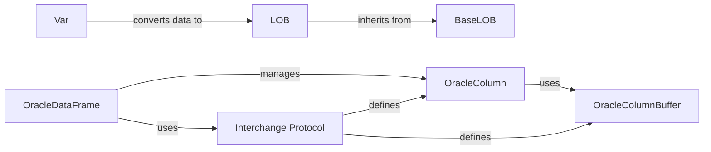

## Component Details

The Data Handling and Interchange component in oracledb facilitates seamless data transfer between Python and Oracle databases, with a strong focus on supporting data science workflows using Pandas. It encompasses mechanisms for mapping Python data types to Oracle types, handling Large Objects (LOBs), and defining protocols for efficient data interchange. The core of this component lies in its ability to represent Oracle data in a format readily consumable by Pandas DataFrames, enabling data scientists to leverage the power of Oracle data within their familiar analytical environment.

### Var
The Var component is responsible for representing variables within the Oracle database context. It plays a crucial role in converting data between Python and Oracle data types, ensuring compatibility and accuracy during data transfer. This component acts as a bridge, enabling Python applications to seamlessly interact with Oracle data.
- **Related Classes/Methods**: `oracledb.var.Var`

### LOB
The LOB component represents a Large Object in the Oracle database. It provides functionalities to interact with LOB data, including reading, writing, and trimming. It handles both persistent and temporary LOBs, allowing applications to efficiently manage large unstructured data stored within the Oracle database.
- **Related Classes/Methods**: `oracledb.lob.LOB`, `oracledb.lob.AsyncLOB`

### BaseLOB
The BaseLOB component serves as the foundation for LOB objects, offering common functionalities such as getting and setting filenames associated with the LOB. It provides a consistent interface for managing LOB metadata and attributes.
- **Related Classes/Methods**: `oracledb.lob.BaseLOB`

### OracleDataFrame
The OracleDataFrame component facilitates data interchange between Oracle database query results and Pandas DataFrames. It enables the creation of DataFrames from Oracle data, allowing data scientists to easily analyze and manipulate Oracle data using Pandas. This component streamlines the integration of Oracle data into data science workflows.
- **Related Classes/Methods**: `oracledb.interchange.dataframe.OracleDataFrame`

### OracleColumn
The OracleColumn component represents a column within an Oracle data structure used for data interchange. It manages the data, validity, and offset buffers associated with the column, ensuring efficient data storage and retrieval. It also provides access to column metadata, enabling applications to understand the structure and properties of the data.
- **Related Classes/Methods**: `oracledb.interchange.column.OracleColumn`

### OracleColumnBuffer
The OracleColumnBuffer component represents the buffer holding the actual data for a column. It's used internally by OracleColumn for efficient data storage and retrieval. This component optimizes memory usage and data access performance during data interchange.
- **Related Classes/Methods**: `oracledb.interchange.buffer.OracleColumnBuffer`

### Interchange Protocol
The Interchange Protocol component defines the structure and format of data during transfer between Oracle and other systems, including Pandas. It ensures consistency and compatibility across different systems, enabling seamless data exchange. This component acts as a blueprint for data representation during interchange.
- **Related Classes/Methods**: `oracledb.interchange.protocol`
