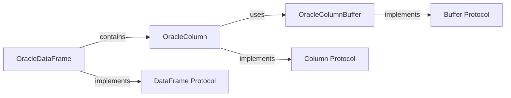

## Component Details

### OracleDataFrame
The `OracleDataFrame` class serves as a container for tabular data retrieved from or intended for an Oracle database. It implements the `DataFrame` protocol, enabling seamless data exchange with other libraries that support this protocol, such as Pandas. It manages columns of data, providing methods to access them by index or name, and supports iterating over the data in chunks for efficient processing of large datasets.
- **Related Classes/Methods**: `repos.python-oracledb.src.oracledb.interchange.dataframe.OracleDataFrame`

### OracleColumn
The `OracleColumn` class represents a single column of data within an `OracleDataFrame`. It implements the `Column` protocol, providing metadata about the column, such as its data type and name. It also provides access to the underlying data buffer (`OracleColumnBuffer`) that stores the column's data.
- **Related Classes/Methods**: `repos.python-oracledb.src.oracledb.interchange.column.OracleColumn`

### OracleColumnBuffer
The `OracleColumnBuffer` class manages the memory buffer that stores the actual data for a column in an `OracleDataFrame`. It implements the `Buffer` protocol, providing methods to access the data and retrieve metadata about the buffer, such as its size and data type. This class is responsible for efficient storage and retrieval of data within a column.
- **Related Classes/Methods**: `repos.python-oracledb.src.oracledb.interchange.buffer.OracleColumnBuffer`

### DataFrame Protocol
The `DataFrame` protocol defines the interface for DataFrame objects used in data interchange. It specifies methods for accessing columns, chunking data, and retrieving metadata. `OracleDataFrame` implements this protocol.
- **Related Classes/Methods**: `oracledb.interchange.protocol.DataFrame`

### Column Protocol
The `Column` protocol defines the interface for Column objects used in data interchange. It specifies methods for accessing data buffers, retrieving metadata, and handling null values. `OracleColumn` implements this protocol.
- **Related Classes/Methods**: `oracledb.interchange.protocol.Column`

### Buffer Protocol
The `Buffer` protocol defines the interface for Buffer objects used in data interchange. It specifies methods for accessing the underlying data and retrieving metadata. `OracleColumnBuffer` implements this protocol.
- **Related Classes/Methods**: `oracledb.interchange.protocol.Buffer`
