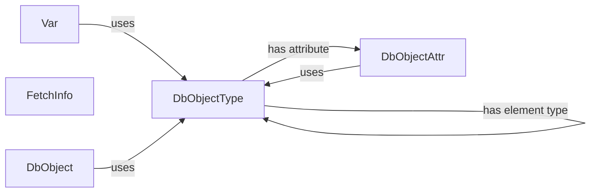

## Component Details

### Var
The Var class serves as a base for managing variables during bind and fetch operations. It handles metadata and buffers, facilitating data exchange between Python and Oracle. It determines the data type and uses DbObjectType for Oracle objects.
- **Related Classes/Methods**: `repos.python-oracledb.src.oracledb.var.Var`

### FetchInfo
The FetchInfo class stores metadata about columns being fetched from the database. This includes information such as the column name, data type, display size, internal size, precision, scale, and nullability. It is used by the cursor to describe the structure of the data being fetched.
- **Related Classes/Methods**: `repos.python-oracledb.src.oracledb.fetch_info.FetchInfo`

### DbObjectType
The DbObjectType class represents the structure and metadata of a database object type in Oracle. It provides methods for creating new objects of that type, accessing attributes, and retrieving the element type if the object is a collection. It encapsulates information about the object's attributes and their types.
- **Related Classes/Methods**: `repos.python-oracledb.src.oracledb.dbobject.DbObjectType`

### DbObject
The DbObject class represents an instance of a database object. It provides methods for accessing and modifying the object's attributes, as well as methods for working with collection objects (objects that contain multiple elements). It relies on DbObjectType to define the structure of the object.
- **Related Classes/Methods**: `repos.python-oracledb.src.oracledb.dbobject.DbObject`

### DbObjectAttr
The DbObjectAttr class represents an attribute of a database object. It stores metadata about the attribute, such as its name, type, precision, and scale. It is used by DbObjectType to describe the attributes of a database object type.
- **Related Classes/Methods**: `repos.python-oracledb.src.oracledb.dbobject.DbObjectAttr`
