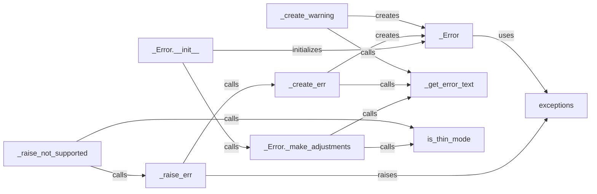

## Component Details

### _Error
The `_Error` class serves as the base class for all exceptions raised by the python-oracledb driver. It encapsulates essential error information, including the error message, context, error code, and offset. It determines the specific exception type to be raised and whether the error is recoverable, providing a consistent foundation for error handling throughout the driver.
- **Related Classes/Methods**: `repos.python-oracledb.src.oracledb.errors._Error`

### _Error.__init__
The `_Error.__init__` method is the constructor for the `_Error` class. It initializes the error object with the provided arguments, such as the error message, context, and error code. It also calls the `_make_adjustments` method to potentially modify the error message based on the driver mode (thin or thick).
- **Related Classes/Methods**: `repos.python-oracledb.src.oracledb.errors._Error.__init__`

### _Error._make_adjustments
The `_Error._make_adjustments` method adjusts the error message based on whether the driver is in thin mode or not. It transforms Oracle and ODPI-C specific error codes to driver errors, if applicable. This ensures that error messages are consistent and informative regardless of the driver mode.
- **Related Classes/Methods**: `repos.python-oracledb.src.oracledb.errors._Error._make_adjustments`

### _get_error_text
The `_get_error_text` function retrieves the error text for a given driver-specific error number. It uses a lookup table (`ERR_MESSAGE_FORMATS`) to map error numbers to corresponding error messages and formats the message with provided arguments. This function centralizes the management of error messages and ensures consistency in error reporting.
- **Related Classes/Methods**: `repos.python-oracledb.src.oracledb.errors._get_error_text`

### _create_err
The `_create_err` function creates a driver-specific error object (`_Error`) for the specified error number and arguments. It calls `_get_error_text` to retrieve the appropriate error message and then instantiates the `_Error` class with the retrieved message and other relevant information. This function simplifies the creation of error objects and ensures that they are properly initialized.
- **Related Classes/Methods**: `repos.python-oracledb.src.oracledb.errors:_create_err`

### _create_warning
The `_create_warning` function creates a warning object (`_Error`) for the specified error number and arguments. It calls `_get_error_text` to retrieve the appropriate warning message and then instantiates the `_Error` class with the retrieved message and the `iswarning` flag set to `True`. This function is similar to `_create_err` but specifically for creating warning objects.
- **Related Classes/Methods**: `repos.python-oracledb.src.oracledb.errors:_create_warning`

### _raise_err
The `_raise_err` function raises a driver-specific exception. It calls `_create_err` to create the error object and then raises the exception, using the exception type determined in the `_Error` class. This function provides a centralized way to raise exceptions within the driver, ensuring consistent error handling.
- **Related Classes/Methods**: `repos.python-oracledb.src.oracledb.errors:_raise_err`

### _raise_not_supported
The `_raise_not_supported` function raises a `NotSupportedError` exception, indicating that a specific feature is not supported. It checks the driver mode using `is_thin_mode` and then calls `_raise_err` to raise the exception. This function is used to indicate when a feature is not available in the current driver mode.
- **Related Classes/Methods**: `repos.python-oracledb.src.oracledb.errors:_raise_not_supported`

### is_thin_mode
The `is_thin_mode` function determines whether the driver is running in thin mode or not. This affects how error messages are adjusted and which features are supported. The driver mode influences the behavior of several error handling functions.
- **Related Classes/Methods**: `repos.python-oracledb.src.oracledb.driver_mode.is_thin_mode`

### exceptions
The `exceptions` module defines the exception classes used by python-oracledb, such as `DatabaseError`, `InterfaceError`, `IntegrityError`, `NotSupportedError`, `OperationalError`, and `ProgrammingError`. These classes inherit from the standard Python `Exception` class and provide a structured way to represent different types of database-related errors.
- **Related Classes/Methods**: `repos.python-oracledb.src.oracledb.exceptions`
