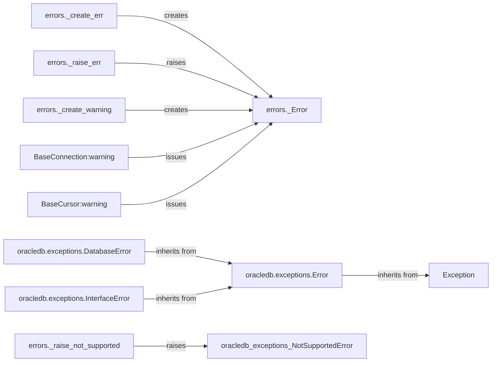

## Component Details

The Error and Exception Handling component in python-oracledb provides a structured way to manage errors and warnings that may occur during database operations. It defines a hierarchy of exception classes, all derived from a base `Error` class, and includes functions for creating and raising specific error types. This system allows the driver to provide informative error messages and enables applications to handle database-related issues gracefully. The component also incorporates a mechanism for issuing warnings, which are less severe than errors but still indicate potential problems.

### errors._Error
Base class for custom error exceptions in python-oracledb. It provides a common structure for error objects, including error code and message. All custom exceptions inherit from this class.
- **Related Classes/Methods**: `oracledb.errors._Error`

### errors._create_err
A factory function responsible for creating specific error instances based on provided error information. It takes error codes and messages as input and returns an instance of a subclass of `_Error`.
- **Related Classes/Methods**: `oracledb.errors:_create_err`

### errors._raise_err
A function that raises an exception. It takes an error object (likely an instance of `_Error` or a subclass) and raises it as a Python exception.
- **Related Classes/Methods**: `oracledb.errors:_raise_err`

### errors._create_warning
A factory function for creating warning objects. Similar to `_create_err`, but for warnings instead of errors. It likely uses the `warnings` module to issue warnings.
- **Related Classes/Methods**: `oracledb.errors:_create_warning`

### BaseConnection:warning
A method of the `BaseConnection` class that issues a warning. It likely uses the `warnings` module to emit a warning related to the connection object.
- **Related Classes/Methods**: `oracledb.connection.BaseConnection:warning`

### BaseCursor:warning
A method of the `BaseCursor` class that issues a warning. It likely uses the `warnings` module to emit a warning related to the cursor object.
- **Related Classes/Methods**: `oracledb.cursor.BaseCursor:warning`

### oracledb.exceptions.Error
Base class for all database exceptions in oracledb. It inherits from Python's built-in Exception class.
- **Related Classes/Methods**: `oracledb.exceptions.Error`

### oracledb.exceptions.DatabaseError
Exception raised for errors related to the database itself. It inherits from oracledb.exceptions.Error.
- **Related Classes/Methods**: `oracledb.exceptions.DatabaseError`

### oracledb.exceptions.InterfaceError
Exception raised for errors related to the database interface. It inherits from oracledb.exceptions.Error.
- **Related Classes/Methods**: `oracledb.exceptions.InterfaceError`

### errors._raise_not_supported
A function that raises a `NotSupportedError` exception. This is used when a feature or operation is not implemented or supported by the driver.
- **Related Classes/Methods**: `oracledb.errors:_raise_not_supported`
