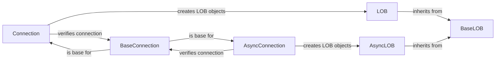

## Component Details

### BaseLOB
Abstract base class for LOB objects, defining common functionalities such as checking LOB types (BFILE vs. non-BFILE) and validating data to be written. It provides a foundation for both synchronous and asynchronous LOB implementations, ensuring consistency in LOB operations.
- **Related Classes/Methods**: `repos.python-oracledb.src.oracledb.lob.BaseLOB`

### LOB
Represents a synchronous Large Object (LOB) in the Oracle database. Inheriting from BaseLOB, it offers methods for reading, writing, and manipulating LOB data within a synchronous context. It provides a way to interact with LOB data in a blocking manner.
- **Related Classes/Methods**: `repos.python-oracledb.src.oracledb.lob.LOB`

### AsyncLOB
Represents an asynchronous Large Object (LOB) in the Oracle database. Inheriting from BaseLOB, it provides asynchronous methods for reading, writing, and manipulating LOB data, enabling non-blocking LOB operations. This allows for more efficient handling of LOB data in concurrent environments.
- **Related Classes/Methods**: `repos.python-oracledb.src.oracledb.lob.AsyncLOB`

### Connection
Represents a synchronous connection to the Oracle database. It provides methods for creating LOB objects and interacts with BaseConnection for connection verification and other connection-related operations. It serves as the entry point for performing synchronous LOB operations.
- **Related Classes/Methods**: `repos.python-oracledb.src.oracledb.connection.Connection`

### AsyncConnection
Represents an asynchronous connection to the Oracle database. Similar to Connection, it provides methods for creating LOB objects but operates in an asynchronous manner, interacting with BaseConnection for connection management. It serves as the entry point for performing asynchronous LOB operations.
- **Related Classes/Methods**: `repos.python-oracledb.src.oracledb.connection.AsyncConnection`

### BaseConnection
Abstract base class for connection objects, providing common connection functionalities such as connection verification. It serves as a base for both synchronous and asynchronous connection implementations, ensuring consistent connection management.
- **Related Classes/Methods**: `repos.python-oracledb.src.oracledb.connection.BaseConnection`
