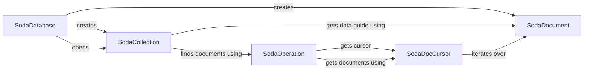

## Component Details

### SodaDatabase
Represents a SODA database and serves as the entry point for interacting with SODA. It provides methods for creating and opening collections, as well as creating documents. It manages the connection to the Oracle database and provides the context for SODA operations.
- **Related Classes/Methods**: `repos.python-oracledb.src.oracledb.soda.SodaDatabase`

### SodaCollection
Represents a SODA collection, which is a group of JSON documents. It provides methods for performing operations on documents within the collection, such as inserting, finding, saving, and retrieving documents. It encapsulates the metadata and operations specific to a collection.
- **Related Classes/Methods**: `repos.python-oracledb.src.oracledb.soda.SodaCollection`

### SodaDocument
Represents a SODA document, which is a single JSON document. It provides methods for accessing and manipulating the document's content. It encapsulates the JSON data and its associated metadata.
- **Related Classes/Methods**: `repos.python-oracledb.src.oracledb.soda.SodaDocument`

### SodaOperation
Represents a SODA operation, which allows to define filters, limits, and other query parameters. It provides methods for executing queries and retrieving documents based on specified criteria. It acts as a builder for constructing SODA queries.
- **Related Classes/Methods**: `repos.python-oracledb.src.oracledb.soda.SodaOperation`

### SodaDocCursor
Represents a cursor for iterating over SODA documents retrieved from a query. It provides a way to efficiently access large result sets. It manages the retrieval of documents in batches and provides an iterator interface.
- **Related Classes/Methods**: `repos.python-oracledb.src.oracledb.soda.SodaDocCursor`
