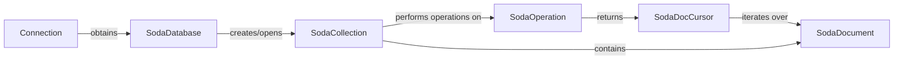

## Component Details

The SODA (Simple Oracle Document Access) component provides a simplified way to interact with JSON documents stored in Oracle Database. It allows users to create SODA databases and collections, insert, query, and manage JSON documents, and iterate through query results. The main flow involves obtaining a connection, accessing a SODA database, working with collections, and performing CRUD operations on documents within those collections.

### Connection
Represents a connection to the Oracle database. It serves as the entry point for accessing SODA functionality through the `getSodaDatabase` method, which allows retrieval of a SodaDatabase instance.
- **Related Classes/Methods**: `python-oracledb.src.oracledb.connection.Connection`, `python-oracledb.utils.templates.connection.Connection`

### SodaDatabase
Represents a SODA database, providing methods to create and open SODA collections. It acts as a container for collections of JSON documents and is obtained from a Connection object.
- **Related Classes/Methods**: `python-oracledb.src.oracledb.soda.SodaDatabase`

### SodaCollection
Represents a SODA collection, which is a set of JSON documents. It provides methods for performing CRUD (Create, Read, Update, Delete) operations on documents within the collection. It is obtained from a SodaDatabase object.
- **Related Classes/Methods**: `python-oracledb.src.oracledb.soda.SodaCollection`

### SodaOperation
Represents a SODA operation, providing methods to execute operations on documents. It allows to get one or multiple documents. It is created from a SodaCollection object.
- **Related Classes/Methods**: `python-oracledb.src.oracledb.soda.SodaOperation`

### SodaDocCursor
Represents a cursor for iterating over SODA documents retrieved from a query. It allows fetching documents one by one. It is returned by a SodaOperation object.
- **Related Classes/Methods**: `python-oracledb.src.oracledb.soda.SodaDocCursor`

### SodaDocument
Represents a SODA document, which is a JSON document stored in the database. It provides methods for accessing the document's content and metadata. It is contained within a SodaCollection.
- **Related Classes/Methods**: `python-oracledb.src.oracledb.soda.SodaDocument`
