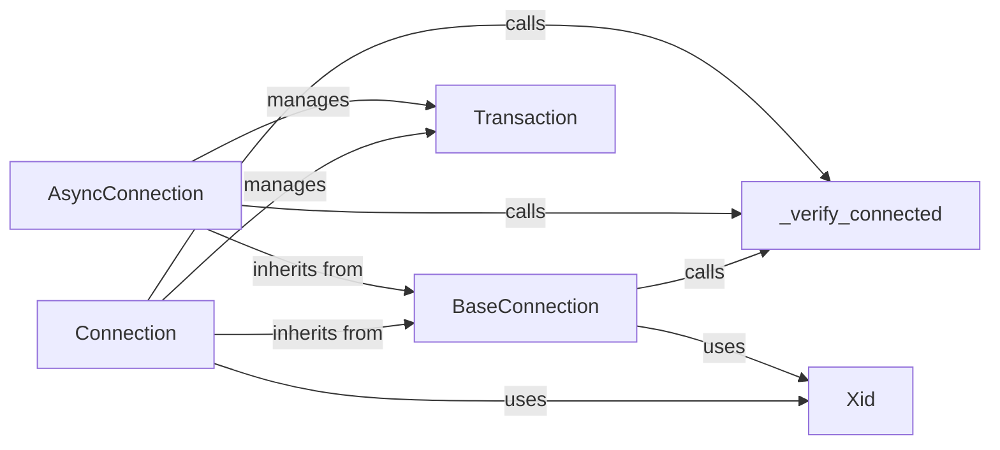

## Component Details

### BaseConnection
Abstract base class for connection objects, providing common functionality for connection management, transaction handling, and attribute access. It defines the basic interface for connection objects, including methods for committing, rolling back, and managing transactions. It also includes the _verify_connected method to ensure the connection is active before performing operations.
- **Related Classes/Methods**: `repos.python-oracledb.src.oracledb.connection.BaseConnection`

### Connection
Represents a synchronous connection to an Oracle database. It inherits from BaseConnection and implements methods for transaction control (commit, rollback), two-phase commit (TPC), and other connection-related operations. It provides a concrete implementation for synchronous database connections, building upon the base connection's functionality.
- **Related Classes/Methods**: `repos.python-oracledb.src.oracledb.connection.Connection`

### AsyncConnection
Represents an asynchronous connection to an Oracle database. It inherits from BaseConnection and provides asynchronous versions of methods for transaction control (commit, rollback), two-phase commit (TPC), and other connection-related operations. It offers a concrete implementation for asynchronous database connections, extending the base connection's capabilities.
- **Related Classes/Methods**: `repos.python-oracledb.src.oracledb.connection.AsyncConnection`

### _verify_connected
A method within BaseConnection that checks if the connection is active before performing operations. It raises an exception if the connection is closed, ensuring that the connection is open before any operation is performed. This method is crucial for maintaining connection integrity and preventing errors.
- **Related Classes/Methods**: `repos.python-oracledb.src.oracledb.connection.BaseConnection`

### Xid
Represents a transaction ID (XID) used for two-phase commit (TPC) transactions. It encapsulates the transaction identifier for distributed transactions, enabling coordination and consistency across multiple databases or systems. This component is essential for managing distributed transactions.
- **Related Classes/Methods**: `repos.python-oracledb.src.oracledb.connection.Xid`

### Transaction
Manages the state of a transaction, including starting, committing, and rolling back. It interacts with the connection object (Connection or AsyncConnection) to execute the transaction commands. This component is responsible for ensuring the atomicity, consistency, isolation, and durability (ACID) properties of database transactions.
- **Related Classes/Methods**: `repos.python-oracledb.src.oracledb.connection.Connection`, `repos.python-oracledb.src.oracledb.connection.AsyncConnection`
