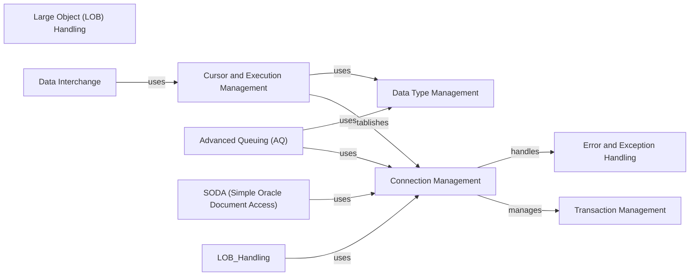

## Component Details

### Connection Management
This component is responsible for establishing, maintaining, and managing connections to the Oracle database. It encompasses connection pooling, authentication plugins for cloud providers (Azure, OCI), and connection string generation. It ensures secure and reliable access to the database.
- **Related Classes/Methods**: `repos.python-oracledb.src.oracledb.connection.BaseConnection`, `repos.python-oracledb.src.oracledb.connection.Connection`, `repos.python-oracledb.src.oracledb.connection.AsyncConnection`, `repos.python-oracledb.src.oracledb.pool.BaseConnectionPool`, `repos.python-oracledb.src.oracledb.pool.ConnectionPool`, `repos.python-oracledb.src.oracledb.pool.AsyncConnectionPool`, `repos.python-oracledb.src.oracledb.connect_params.ConnectParams`, `repos.python-oracledb.src.oracledb.pool_params.PoolParams`, `repos.python-oracledb.src.oracledb.plugins.azure_tokens`, `repos.python-oracledb.src.oracledb.plugins.oci_tokens`, `repos.python-oracledb.src.oracledb.plugins.oci_config_provider`, `repos.python-oracledb.src.oracledb.plugins.azure_config_provider`, `repos.python-oracledb.src.oracledb.dsn`

### Cursor and Execution Management
This component handles the execution of SQL statements and PL/SQL blocks, fetching results, and managing cursor attributes. It supports both synchronous and asynchronous operations, providing the core functionality for interacting with the database and retrieving data.
- **Related Classes/Methods**: `repos.python-oracledb.src.oracledb.cursor.BaseCursor`, `repos.python-oracledb.src.oracledb.cursor.Cursor`, `repos.python-oracledb.src.oracledb.cursor.AsyncCursor`

### Large Object (LOB) Handling
This component provides the functionality to read, write, and manipulate Large Object (LOB) data types within the Oracle database. It supports both synchronous and asynchronous LOB operations, enabling the management of large unstructured data.
- **Related Classes/Methods**: `repos.python-oracledb.src.oracledb.lob.BaseLOB`, `repos.python-oracledb.src.oracledb.lob.LOB`, `repos.python-oracledb.src.oracledb.lob.AsyncLOB`

### Advanced Queuing (AQ)
This component enables message queuing functionality within the Oracle database, allowing applications to enqueue and dequeue messages for asynchronous communication. It supports both synchronous and asynchronous queuing operations, facilitating asynchronous communication between applications.
- **Related Classes/Methods**: `repos.python-oracledb.src.oracledb.aq.BaseQueue`, `repos.python-oracledb.src.oracledb.aq.Queue`, `repos.python-oracledb.src.oracledb.aq.AsyncQueue`, `repos.python-oracledb.src.oracledb.aq.DeqOptions`, `repos.python-oracledb.src.oracledb.aq.EnqOptions`, `repos.python-oracledb.src.oracledb.aq.MessageProperties`

### SODA (Simple Oracle Document Access)
This component offers a simplified way to store and retrieve JSON documents in the Oracle database. It allows applications to interact with JSON data without needing to write SQL queries, providing a NoSQL-like interface for JSON data management.
- **Related Classes/Methods**: `repos.python-oracledb.src.oracledb.soda.SodaDatabase`, `repos.python-oracledb.src.oracledb.soda.SodaCollection`, `repos.python-oracledb.src.oracledb.soda.SodaDocument`, `repos.python-oracledb.src.oracledb.soda.SodaOperation`, `repos.python-oracledb.src.oracledb.soda.SodaDocCursor`

### Data Interchange
This component facilitates the efficient exchange of data between Python and Oracle Database, focusing on tabular data. It leverages the Python Data Interchange Protocol for optimized data transfer with libraries like Pandas, improving data integration capabilities.
- **Related Classes/Methods**: `repos.python-oracledb.src.oracledb.interchange.dataframe.OracleDataFrame`, `repos.python-oracledb.src.oracledb.interchange.column.OracleColumn`, `repos.python-oracledb.src.oracledb.interchange.buffer.OracleColumnBuffer`

### Error and Exception Handling
This component defines the error and warning classes used by the python-oracledb driver. It provides a consistent way to handle errors and warnings raised by the Oracle database, ensuring robust error management and reporting.
- **Related Classes/Methods**: `repos.python-oracledb.src.oracledb.errors._Error`, `repos.python-oracledb.src.oracledb.exceptions`

### Transaction Management
This component provides the ability to manage transactions within the Oracle database, including committing and rolling back changes. It also supports distributed transactions using XA, ensuring data consistency and integrity through transaction control.
- **Related Classes/Methods**: `repos.python-oracledb.src.oracledb.connection.BaseConnection`

### Data Type Management
This component manages the mapping between Python data types and Oracle data types. It provides functionality to convert data between the two systems, ensuring seamless data conversion and compatibility.
- **Related Classes/Methods**: `repos.python-oracledb.src.oracledb.var.Var`, `repos.python-oracledb.src.oracledb.fetch_info.FetchInfo`