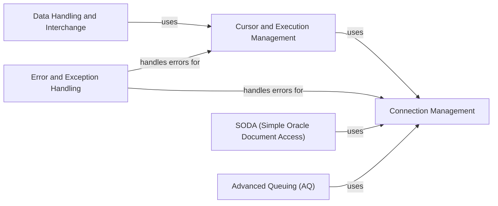

## Component Details

The python-oracledb library facilitates interaction with Oracle databases, offering functionalities ranging from basic connection management and query execution to advanced features like connection pooling, asynchronous operations, SODA for JSON document access, and AQ for message queuing. It supports various data types, including LOBs, and provides mechanisms for error handling and data interchange with tools like Pandas. The library is structured to allow both synchronous and asynchronous database operations, catering to different application needs.

### Connection Management
This component is responsible for establishing and managing connections to the Oracle database. It handles connection creation, authentication, connection attributes, connection pooling, and closing connections. It supports both synchronous and asynchronous connections.
- **Related Classes/Methods**: `oracledb.connection.BaseConnection`, `oracledb.connection.Connection`, `oracledb.connection.AsyncConnection`, `oracledb.connect_params.ConnectParams`, `oracledb.pool.BaseConnectionPool`, `oracledb.pool.ConnectionPool`, `oracledb.pool.AsyncConnectionPool`, `oracledb.pool_params.PoolParams`

### Cursor and Execution Management
This component manages the execution of SQL queries and PL/SQL blocks. It provides functionalities for creating cursors, binding parameters, executing statements, fetching results, and managing cursor attributes. It supports both synchronous and asynchronous cursor operations and pipeline operations.
- **Related Classes/Methods**: `oracledb.cursor.BaseCursor`, `oracledb.cursor.Cursor`, `oracledb.cursor.AsyncCursor`, `oracledb.pipeline.Pipeline`, `oracledb.pipeline.PipelineOp`, `oracledb.pipeline.PipelineOpResult`

### Data Handling and Interchange
This component handles the mapping of data types between Python and Oracle, including LOBs. It also facilitates data exchange with other systems, particularly focusing on integration with data science tools like Pandas, defining protocols and structures for representing data in a format suitable for interchange.
- **Related Classes/Methods**: `oracledb.var.Var`, `oracledb.lob.BaseLOB`, `oracledb.lob.LOB`, `oracledb.lob.AsyncLOB`, `oracledb.interchange.protocol`, `oracledb.interchange.buffer`, `oracledb.interchange.column`, `oracledb.interchange.dataframe`, `oracledb.interchange.column.OracleColumn`, `oracledb.interchange.buffer.OracleColumnBuffer`, `oracledb.interchange.dataframe.OracleDataFrame`

### Error and Exception Handling
This component provides a mechanism for handling errors and exceptions that occur during database operations. It defines error types, raises exceptions, and handles warnings, ensuring robust error management throughout the library.
- **Related Classes/Methods**: `oracledb.errors._Error`, `oracledb.exceptions.Error`, `oracledb.exceptions.DatabaseError`, `oracledb.exceptions.InterfaceError`, `oracledb.exceptions.OperationalError`, `oracledb.exceptions.ProgrammingError`, `oracledb.exceptions.IntegrityError`, `oracledb.exceptions.DataError`, `oracledb.exceptions.NotSupportedError`, `oracledb.exceptions.Warning`

### SODA (Simple Oracle Document Access)
This component provides a simplified way to access and manage JSON documents stored in Oracle Database. It includes functionalities for creating SODA databases, creating collections, inserting documents, querying documents, and managing document metadata.
- **Related Classes/Methods**: `oracledb.soda.SodaDatabase`, `oracledb.soda.SodaCollection`, `oracledb.soda.SodaDocument`, `oracledb.soda.SodaDocCursor`, `oracledb.soda.SodaOperation`

### Advanced Queuing (AQ)
This component provides support for Oracle Advanced Queuing, a message queuing system integrated with the database. It includes functionalities for creating queues, enqueueing messages, dequeueing messages, and managing queue attributes. It supports both synchronous and asynchronous queuing operations.
- **Related Classes/Methods**: `oracledb.aq.BaseQueue`, `oracledb.aq.Queue`, `oracledb.aq.AsyncQueue`, `oracledb.aq.MessageProperties`, `oracledb.aq.EnqOptions`, `oracledb.aq.DeqOptions`