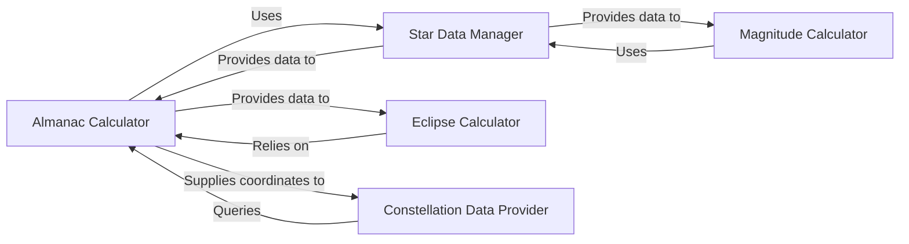

## Details

The `skyfield` subsystem is designed around a core set of astronomical calculation and data management capabilities. The `Almanac Calculator` serves as a central computational engine, responsible for determining precise astronomical event times and object properties. It relies heavily on the `Star Data Manager` for accessing and processing fundamental star data, which is crucial for many calculations. Specialized components like the `Magnitude Calculator` and `Eclipse Calculator` extend these capabilities; the `Magnitude Calculator` also utilizes the `Star Data Manager` for relevant star properties, while the `Eclipse Calculator` depends on the `Almanac Calculator` for accurate positional and event data necessary for eclipse computations. Furthermore, the `Constellation Data Provider` integrates with the `Almanac Calculator` to obtain celestial coordinates, enabling it to identify the constellation for a given point in the sky. This architecture establishes a clear flow where data is managed, core calculations are performed, and specialized services build upon these foundational computational and data-providing components.

### Almanac Calculator
This component serves as the core computational engine for determining precise times of astronomical events (like risings, settings, transits) and calculating properties such as the illuminated fraction and phase angle of celestial objects. It acts as the primary interface for event-driven astronomical queries.

**Related Classes/Methods**:

- <a href="https://github.com/skyfielders/python-skyfield/blob/master/skyfield/almanac.py" target="_blank" rel="noopener noreferrer">`skyfield/almanac.py`</a>

### Star Data Manager
Manages the representation, initialization, and processing of star data. This includes converting external data formats into internal vector representations suitable for computations and providing access to a curated list of named stars.

**Related Classes/Methods**:

- <a href="https://github.com/skyfielders/python-skyfield/blob/master/skyfield/starlib.py" target="_blank" rel="noopener noreferrer">`skyfield/starlib.py`</a>
- <a href="https://github.com/skyfielders/python-skyfield/blob/master/skyfield/named_stars.py" target="_blank" rel="noopener noreferrer">`skyfield/named_stars.py`</a>

### Magnitude Calculator
Calculates the apparent magnitude of celestial bodies, implementing specific algorithms tailored for different objects (e.g., Saturn).

**Related Classes/Methods**:

- <a href="https://github.com/skyfielders/python-skyfield/blob/master/skyfield/magnitudelib.py" target="_blank" rel="noopener noreferrer">`skyfield/magnitudelib.py`</a>

### Eclipse Calculator
Focuses on computations related to eclipses, including identifying eclipse types, times, and visibility.

**Related Classes/Methods**:

- <a href="https://github.com/skyfielders/python-skyfield/blob/master/skyfield/eclipselib.py" target="_blank" rel="noopener noreferrer">`skyfield/eclipselib.py`</a>

### Constellation Data Provider
Provides data and functions related to constellations, such as identifying which constellation a given celestial coordinate falls within.

**Related Classes/Methods**:

- <a href="https://github.com/skyfielders/python-skyfield/blob/master/skyfield/constellationlib.py" target="_blank" rel="noopener noreferrer">`skyfield/constellationlib.py`</a>

### [FAQ](https://github.com/CodeBoarding/GeneratedOnBoardings/tree/main?tab=readme-ov-file#faq)