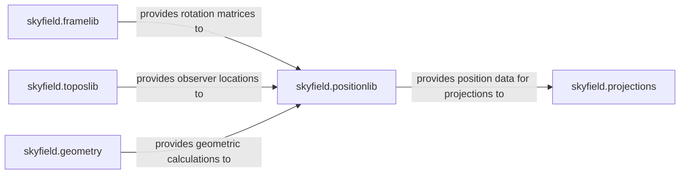

## Details

The `skyfield` subsystem is designed around a core `positionlib` component that manages astronomical positions and their transformations. This core component is supported by `framelib`, which provides the essential rotational mechanics for coordinate system conversions, and `geometry`, which offers fundamental geometric utilities. `toposlib` extends the system by enabling calculations from specific Earth-based observer locations, integrating with `positionlib` for geocentric computations. Finally, `projections` utilizes the position data to visualize celestial coordinates. This modular design ensures that each component focuses on a specific aspect of astronomical computation, promoting reusability and maintainability.

### skyfield.positionlib
This is the central component for representing astronomical positions (e.g., Barycentric, Apparent, Astrometric) and performing transformations between various celestial coordinate systems (e.g., ICRF, GCRS). It defines classes like `ICRF`, `Barycentric`, and `Geocentric` which encapsulate position and velocity vectors. It orchestrates coordinate-related operations, including calculating distances, speeds, and converting to right ascension and declination. It imports `framelib` for rotations and `geometry` for intersection calculations.

**Related Classes/Methods**:

- <a href="https://github.com/skyfielders/python-skyfield/blob/master/skyfield/positionlib.py" target="_blank" rel="noopener noreferrer">`skyfield.positionlib`</a>

### skyfield.framelib
Provides functions and classes to generate rotation matrices essential for transforming coordinates between different celestial frames. It defines various reference frames such as `ICRS`, `mean_equator_and_equinox_of_date`, `true_equator_and_equinox_of_date`, `tirs`, `itrs`, and `ecliptic_frame`. These frames are crucial for defining the orientation of coordinate systems at a given time. It serves as a specialized service for rotational mechanics, used by `positionlib` for coordinate transformations.

**Related Classes/Methods**:

- <a href="https://github.com/skyfielders/python-skyfield/blob/master/skyfield/framelib.py" target="_blank" rel="noopener noreferrer">`skyfield.framelib`</a>

### skyfield.toposlib
Represents specific locations on Earth (topocentric coordinates) and handles calculations related to these observer points, such as atmospheric refraction and determining geographic positions. It defines `GeographicPosition` and `Geoid` classes, allowing users to specify locations by latitude, longitude, and elevation. It interacts with `framelib` to obtain Earth-fixed reference frame rotations and provides methods to calculate Local Apparent Sidereal Time (LAST) and refract altitudes.

**Related Classes/Methods**:

- <a href="https://github.com/skyfielders/python-skyfield/blob/master/skyfield/toposlib.py" target="_blank" rel="noopener noreferrer">`skyfield.toposlib`</a>

### skyfield.geometry
Offers fundamental geometric calculations, such as determining the intersection of a line with a sphere or an ellipsoid. This is crucial for scenarios like occultation checks or general vector mathematics underlying astronomical computations. It provides functions like `intersect_line_and_sphere` and `line_and_ellipsoid_intersection`. This component is utilized by `positionlib` for specific geometric problems.

**Related Classes/Methods**:

- <a href="https://github.com/skyfielders/python-skyfield/blob/master/skyfield/geometry.py" target="_blank" rel="noopener noreferrer">`skyfield.geometry`</a>

### skyfield.projections
Defines various astronomical projection methods used for mapping celestial coordinates onto a 2D plane, often for charting or visualization purposes. It provides the `build_stereographic_projection` function, which takes a central point and returns a function to project other positions onto a 2D plane. It acts as a repository of projection algorithms, consuming data from `positionlib`.

**Related Classes/Methods**:

- <a href="https://github.com/skyfielders/python-skyfield/blob/master/skyfield/projections.py" target="_blank" rel="noopener noreferrer">`skyfield.projections`</a>

### [FAQ](https://github.com/CodeBoarding/GeneratedOnBoardings/tree/main?tab=readme-ov-file#faq)