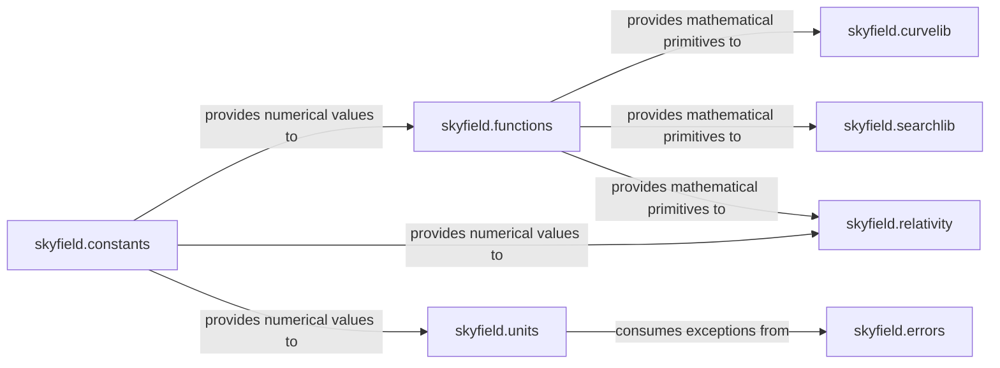

## Details

Analysis of the Core Utilities & Numerical Operations subsystem of the Skyfield library.

### skyfield.functions
Provides fundamental mathematical utilities for vector algebra (e.g., angle_between, length_of, dots) and 3D rotations (R1, R2, R3, mxm). It also handles Cartesian to spherical coordinate conversions. This module serves as a core numerical engine for basic geometric and vector operations.

**Related Classes/Methods**:

- <a href="https://github.com/skyfielders/python-skyfield/blob/master/skyfield/functions.py" target="_blank" rel="noopener noreferrer">`skyfield.functions:angle_between`</a>
- <a href="https://github.com/skyfielders/python-skyfield/blob/master/skyfield/functions.py" target="_blank" rel="noopener noreferrer">`skyfield.functions:length_of`</a>
- <a href="https://github.com/skyfielders/python-skyfield/blob/master/skyfield/functions.py" target="_blank" rel="noopener noreferrer">`skyfield.functions:dots`</a>
- <a href="https://github.com/skyfielders/python-skyfield/blob/master/skyfield/functions.py" target="_blank" rel="noopener noreferrer">`skyfield.functions:R1`</a>
- <a href="https://github.com/skyfielders/python-skyfield/blob/master/skyfield/functions.py" target="_blank" rel="noopener noreferrer">`skyfield.functions:R2`</a>
- <a href="https://github.com/skyfielders/python-skyfield/blob/master/skyfield/functions.py" target="_blank" rel="noopener noreferrer">`skyfield.functions:R3`</a>
- <a href="https://github.com/skyfielders/python-skyfield/blob/master/skyfield/functions.py" target="_blank" rel="noopener noreferrer">`skyfield.functions:mxm`</a>

### skyfield.units
Manages astronomical unit conversions (e.g., radians, degrees, arcseconds) and handles sexagesimal (HMS/DMS) parsing and formatting. It ensures consistency and correctness of numerical values across different units.

**Related Classes/Methods**:

- <a href="https://github.com/skyfielders/python-skyfield/blob/master/skyfield/units.py" target="_blank" rel="noopener noreferrer">`skyfield.units`</a>

### skyfield.curvelib
Focuses on spline curve representation and manipulation, particularly for computing derivatives. The Splines class is central, enabling interpolation and differentiation of data.

**Related Classes/Methods**:

- <a href="https://github.com/skyfielders/python-skyfield/blob/master/skyfield/curvelib.py#L8-L38" target="_blank" rel="noopener noreferrer">`skyfield.curvelib.Splines`:8-38</a>

### skyfield.searchlib
Implements numerical search algorithms to find specific values, minima, and maxima within data arrays. This is crucial for solving equations or finding critical points in astronomical models.

**Related Classes/Methods**:

- <a href="https://github.com/skyfielders/python-skyfield/blob/master/skyfield/searchlib.py" target="_blank" rel="noopener noreferrer">`skyfield.searchlib`</a>

### skyfield.relativity
Calculates and applies relativistic corrections, specifically for light deflection. This is a specialized but essential numerical operation for high-precision astronomical calculations.

**Related Classes/Methods**:

- <a href="https://github.com/skyfielders/python-skyfield/blob/master/skyfield/relativity.py" target="_blank" rel="noopener noreferrer">`skyfield.relativity`</a>

### skyfield.constants
Serves as a central repository for various physical and astronomical constants (e.g., speed of light, gravitational constant) used throughout the library's numerical computations.

**Related Classes/Methods**:

- <a href="https://github.com/skyfielders/python-skyfield/blob/master/skyfield/constants.py" target="_blank" rel="noopener noreferrer">`skyfield.constants`</a>

### skyfield.errors
Defines custom exception classes for specific error conditions within the Skyfield library, such as WrongUnitError. While not directly a numerical operation, it provides robust error handling for the numerical and utility components.

**Related Classes/Methods**:

- <a href="https://github.com/skyfielders/python-skyfield/blob/master/skyfield/errors.py" target="_blank" rel="noopener noreferrer">`skyfield.errors.WrongUnitError`</a>

### [FAQ](https://github.com/CodeBoarding/GeneratedOnBoardings/tree/main?tab=readme-ov-file#faq)