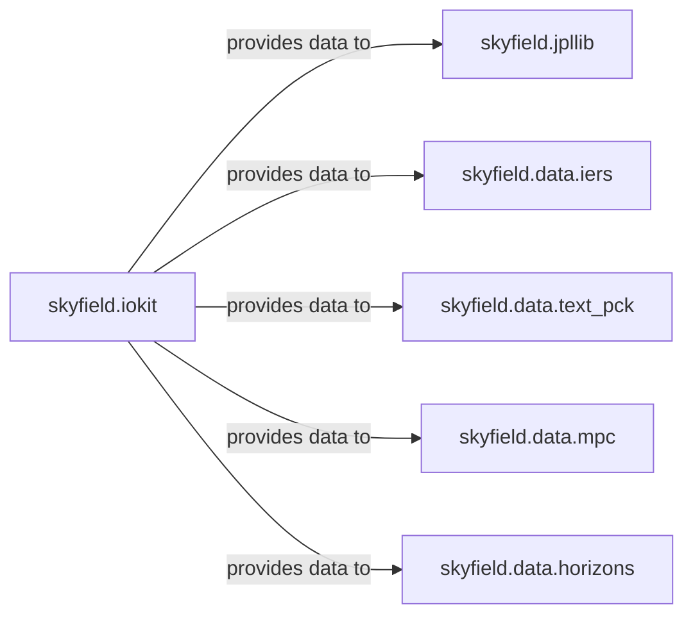

## Details

The `Data I/O & Persistence` subsystem is responsible for the acquisition, parsing, and management of external astronomical data files. Its boundaries encompass modules dedicated to file system interaction, data downloading, and the specialized parsing and internal representation of various astronomical datasets such as JPL ephemerides, TLEs, IERS data, and minor planet observations.

### skyfield.iokit
Acts as the primary interface for file system interactions, managing data acquisition (downloads, path resolution), and initial parsing of generic data formats like TLEs. It serves as the entry point for most external data into the Skyfield library.

**Related Classes/Methods**:

- <a href="https://github.com/skyfielders/python-skyfield/blob/master/skyfield/iokit.py" target="_blank" rel="noopener noreferrer">`skyfield.iokit`</a>

### skyfield.jpllib
Manages the internal representation, decoding, and efficient querying of large JPL ephemeris data (SPICE kernels). It acts as the specialized persistence layer for this critical dataset.

**Related Classes/Methods**:

- <a href="https://github.com/skyfielders/python-skyfield/blob/master/skyfield/jpllib.py" target="_blank" rel="noopener noreferrer">`skyfield.jpllib`</a>

### skyfield.data.iers
Specializes in parsing IERS finals.all files to extract Earth orientation parameters (e.g., DUT1, x, y), which are crucial for precise coordinate transformations.

**Related Classes/Methods**:

- <a href="https://github.com/skyfielders/python-skyfield/blob/master/skyfield/data/iers.py" target="_blank" rel="noopener noreferrer">`skyfield.data.iers`</a>

### skyfield.data.text_pck
Handles the loading and parsing of text-based Planetary Constants Kernel (PCK) files, converting raw text into usable ephemeris data for celestial bodies.

**Related Classes/Methods**:

- <a href="https://github.com/skyfielders/python-skyfield/blob/master/skyfield/data/text_pck.py" target="_blank" rel="noopener noreferrer">`skyfield.data.text_pck`</a>

### skyfield.data.mpc
Provides utilities for unpacking and processing minor planet orbital elements from Minor Planet Center (MPC) files, enabling the calculation of minor body positions.

**Related Classes/Methods**:

- <a href="https://github.com/skyfielders/python-skyfield/blob/master/skyfield/data/mpc.py" target="_blank" rel="noopener noreferrer">`skyfield.data.mpc`</a>

### skyfield.data.horizons
Facilitates interaction with and parsing of data retrieved from the JPL Horizons system, allowing for on-demand ephemeris or observational data for various celestial bodies.

**Related Classes/Methods**:

- <a href="https://github.com/skyfielders/python-skyfield/blob/master/skyfield/data/horizons.py" target="_blank" rel="noopener noreferrer">`skyfield.data.horizons`</a>

### [FAQ](https://github.com/CodeBoarding/GeneratedOnBoardings/tree/main?tab=readme-ov-file#faq)