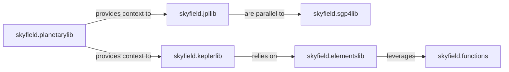

## Details

The Orbital Mechanics & Propagation subsystem is primarily encapsulated within the skyfield library, specifically the jpllib, keplerlib, sgp4lib, elementslib, planetarylib, and functions modules. These modules collectively handle the core computational aspects of celestial mechanics and satellite propagation.

### skyfield.jpllib
Manages the interface with and processing of JPL ephemeris data files (e.g., DE421, DE430). It provides precise positions and velocities for solar system bodies like planets, the Moon, and the Sun, serving as a foundational data source for high-precision calculations.

**Related Classes/Methods**:

- <a href="https://github.com/skyfielders/python-skyfield/blob/master/skyfield/jpllib.py" target="_blank" rel="noopener noreferrer">`skyfield.jpllib`</a>

### skyfield.keplerlib
Implements the propagation of orbits based on Kepler's laws. This component supports various trajectory types (elliptic, parabolic, hyperbolic) and computes positions and velocities at specified times from initial orbital elements. It is central to classical orbital mechanics.

**Related Classes/Methods**:

- <a href="https://github.com/skyfielders/python-skyfield/blob/master/skyfield/keplerlib.py" target="_blank" rel="noopener noreferrer">`skyfield.keplerlib`</a>

### skyfield.sgp4lib
Dedicated to the propagation of Earth-orbiting artificial satellites. It specifically implements the Simplified General Perturbations (SGP4) model, which uses Two-Line Element (TLE) sets as input, making it crucial for satellite tracking and prediction.

**Related Classes/Methods**:

- <a href="https://github.com/skyfielders/python-skyfield/blob/master/skyfield/sgp4lib.py" target="_blank" rel="noopener noreferrer">`skyfield.sgp4lib`</a>

### skyfield.elementslib
Provides functionalities for deriving and converting classical orbital elements (e.g., semi-major axis, eccentricity, inclination) from state vectors (position and velocity). This component acts as a bridge between different representations of an orbit.

**Related Classes/Methods**:

- <a href="https://github.com/skyfielders/python-skyfield/blob/master/skyfield/elementslib.py" target="_blank" rel="noopener noreferrer">`skyfield.elementslib`</a>

### skyfield.planetarylib
Defines and manages celestial bodies (planets, moons, asteroids) as objects within the Skyfield system. It includes their physical properties and associated coordinate frames, providing the abstract representation of astronomical entities.

**Related Classes/Methods**:

- <a href="https://github.com/skyfielders/python-skyfield/blob/master/skyfield/planetarylib.py" target="_blank" rel="noopener noreferrer">`skyfield.planetarylib`</a>

### skyfield.functions
Offers fundamental vector mathematics and numerical utilities that are leveraged by other components for core computations. While not directly an orbital mechanics component, its foundational mathematical operations are indispensable for the entire subsystem.

**Related Classes/Methods**:

- <a href="https://github.com/skyfielders/python-skyfield/blob/master/skyfield/functions.py" target="_blank" rel="noopener noreferrer">`skyfield.functions`</a>

### [FAQ](https://github.com/CodeBoarding/GeneratedOnBoardings/tree/main?tab=readme-ov-file#faq)