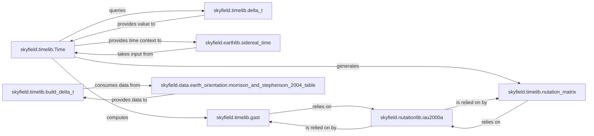

## Details

The `Time & Ephemeris Core` subsystem is central to Skyfield, handling all time-related calculations, conversions between different time scales, and managing Earth orientation parameters. It embodies the "Computational Engine" and "Data Processing Pipeline" architectural patterns, providing foundational data and calculations for astronomical computations.

### skyfield.timelib.Time
The primary class representing time, serving as the central interface for users to interact with various time scales (UTC, TAI, TT, TDB, UT1) and perform time arithmetic. It acts as the main entry point for time-related operations.

**Related Classes/Methods**:

- <a href="https://github.com/skyfielders/python-skyfield/blob/master/skyfield/timelib.py#L412-L974" target="_blank" rel="noopener noreferrer">`skyfield.timelib.Time`:412-974</a>

### skyfield.timelib.delta_t
A function responsible for calculating and managing the Delta T (ΔT) value, which is critical for converting between Terrestrial Time (TT) and Universal Time 1 (UT1). It's a core computational element for time scale synchronization.

**Related Classes/Methods**:

- <a href="https://github.com/skyfielders/python-skyfield/blob/master/skyfield/timelib.py" target="_blank" rel="noopener noreferrer">`skyfield.timelib.delta_t`</a>

### skyfield.timelib.build_delta_t
A function responsible for preparing the necessary lookup tables for Delta T calculation. It acts as a data preparation component, ensuring `delta_t` has the required empirical data.

**Related Classes/Methods**:

- <a href="https://github.com/skyfielders/python-skyfield/blob/master/skyfield/timelib.py#L1094-L1174" target="_blank" rel="noopener noreferrer">`skyfield.timelib.build_delta_t`:1094-1174</a>

### skyfield.nutationlib.iau2000a
Implements the International Astronomical Union (IAU) 2000A model, providing the fundamental calculations for Earth's nutation in longitude and obliquity. This is a core computational engine for Earth orientation.

**Related Classes/Methods**:

- <a href="https://github.com/skyfielders/python-skyfield/blob/master/skyfield/nutationlib.py#L236-L299" target="_blank" rel="noopener noreferrer">`skyfield.nutationlib.iau2000a`:236-299</a>

### skyfield.earthlib.sidereal_time
A function that computes Earth's rotational orientation, specifically Greenwich Sidereal Time. It's a key calculation for determining Earth's precise orientation in space.

**Related Classes/Methods**:

- <a href="https://github.com/skyfielders/python-skyfield/blob/master/skyfield/earthlib.py#L108-L125" target="_blank" rel="noopener noreferrer">`skyfield.earthlib.sidereal_time`:108-125</a>

### skyfield.timelib.gast
A function that computes Earth's rotational orientation, specifically Greenwich Apparent Sidereal Time (GAST). It refines sidereal time by incorporating nutation effects.

**Related Classes/Methods**:

- <a href="https://github.com/skyfielders/python-skyfield/blob/master/skyfield/timelib.py#L855-L863" target="_blank" rel="noopener noreferrer">`skyfield.timelib.gast`:855-863</a>

### skyfield.data.earth_orientation.morrison_and_stephenson_2004_table
A data component that provides the empirical historical and predictive data for Earth orientation parameters, including Delta T values. It serves as a crucial data source for time and orientation calculations.

**Related Classes/Methods**:

- <a href="https://github.com/skyfielders/python-skyfield/blob/master/skyfield/data/earth_orientation.py#L9-L15" target="_blank" rel="noopener noreferrer">`skyfield.data.earth_orientation.morrison_and_stephenson_2004_table`:9-15</a>

### skyfield.timelib.nutation_matrix
Generates rotational data for nutation, translating the nutation angles into a transformation matrix. This component is essential for applying Earth orientation corrections in coordinate transformations.

**Related Classes/Methods**:

- <a href="https://github.com/skyfielders/python-skyfield/blob/master/skyfield/timelib.py#L901-L906" target="_blank" rel="noopener noreferrer">`skyfield.timelib.nutation_matrix`:901-906</a>

### [FAQ](https://github.com/CodeBoarding/GeneratedOnBoardings/tree/main?tab=readme-ov-file#faq)