```mermaid
graph LR
    Data_I_O_Persistence["Data I/O & Persistence"]
    Time_Ephemeris_Core["Time & Ephemeris Core"]
    Orbital_Mechanics_Propagation["Orbital Mechanics & Propagation"]
    Coordinate_Systems_Transformations["Coordinate Systems & Transformations"]
    Astronomical_Calculations_Almanac["Astronomical Calculations & Almanac"]
    Core_Utilities_Numerical_Operations["Core Utilities & Numerical Operations"]
    Public_API_User_Interface["Public API & User Interface"]
    Public_API_User_Interface -- "initiates data loading" --> Data_I_O_Persistence
    Data_I_O_Persistence -- "provides loaded astronomical data" --> Public_API_User_Interface
    Public_API_User_Interface -- "requests time objects" --> Time_Ephemeris_Core
    Time_Ephemeris_Core -- "provides precise time instances" --> Public_API_User_Interface
    Public_API_User_Interface -- "requests celestial positions" --> Orbital_Mechanics_Propagation
    Orbital_Mechanics_Propagation -- "provides calculated position/velocity" --> Public_API_User_Interface
    Public_API_User_Interface -- "requests coordinate transformations" --> Coordinate_Systems_Transformations
    Coordinate_Systems_Transformations -- "provides transformed positional data" --> Public_API_User_Interface
    Public_API_User_Interface -- "requests astronomical events" --> Astronomical_Calculations_Almanac
    Astronomical_Calculations_Almanac -- "provides event and almanac data" --> Public_API_User_Interface
    Data_I_O_Persistence -- "Supplies IERS and Delta-T data for time calculations" --> Time_Ephemeris_Core
    Data_I_O_Persistence -- "Supplies ephemeris and orbital elements for propagation" --> Orbital_Mechanics_Propagation
    Data_I_O_Persistence -- "Provides star catalogs and other static astronomical data" --> Astronomical_Calculations_Almanac
    Time_Ephemeris_Core -- "Provides time objects for accurate orbital propagation" --> Orbital_Mechanics_Propagation
    Time_Ephemeris_Core -- "Supplies time objects and Earth orientation matrices for transformations" --> Coordinate_Systems_Transformations
    Time_Ephemeris_Core -- "Provides time context for event calculations" --> Astronomical_Calculations_Almanac
    Orbital_Mechanics_Propagation -- "Outputs raw position and velocity vectors for coordinate conversion" --> Coordinate_Systems_Transformations
    Coordinate_Systems_Transformations -- "Provides transformed positional data for higher-level event computations" --> Astronomical_Calculations_Almanac
    Core_Utilities_Numerical_Operations -- "Provides fundamental numerical support, mathematical functions, and unit conversions" --> Data_I_O_Persistence
    Core_Utilities_Numerical_Operations -- "Provides fundamental numerical support, mathematical functions, and unit conversions" --> Time_Ephemeris_Core
    Core_Utilities_Numerical_Operations -- "Provides fundamental numerical support, mathematical functions, and unit conversions" --> Orbital_Mechanics_Propagation
    Core_Utilities_Numerical_Operations -- "Provides fundamental numerical support, mathematical functions, and unit conversions" --> Coordinate_Systems_Transformations
    Core_Utilities_Numerical_Operations -- "Provides fundamental numerical support, mathematical functions, and unit conversions" --> Astronomical_Calculations_Almanac
    Core_Utilities_Numerical_Operations -- "Provides fundamental numerical support, mathematical functions, and unit conversions" --> Public_API_User_Interface
    click Data_I_O_Persistence href "https://github.com/CodeBoarding/GeneratedOnBoardings/blob/main/python-skyfield/Data_I_O_Persistence.md" "Details"
    click Time_Ephemeris_Core href "https://github.com/CodeBoarding/GeneratedOnBoardings/blob/main/python-skyfield/Time_Ephemeris_Core.md" "Details"
    click Orbital_Mechanics_Propagation href "https://github.com/CodeBoarding/GeneratedOnBoardings/blob/main/python-skyfield/Orbital_Mechanics_Propagation.md" "Details"
    click Coordinate_Systems_Transformations href "https://github.com/CodeBoarding/GeneratedOnBoardings/blob/main/python-skyfield/Coordinate_Systems_Transformations.md" "Details"
    click Astronomical_Calculations_Almanac href "https://github.com/CodeBoarding/GeneratedOnBoardings/blob/main/python-skyfield/Astronomical_Calculations_Almanac.md" "Details"
    click Core_Utilities_Numerical_Operations href "https://github.com/CodeBoarding/GeneratedOnBoardings/blob/main/python-skyfield/Core_Utilities_Numerical_Operations.md" "Details"
```

## Details

The `python-skyfield` library is structured as a modular, data-driven computational pipeline for astronomical calculations. At its core, it ingests diverse astronomical datasets via `Data I/O & Persistence`, which are then synchronized with precise time information from the `Time & Ephemeris Core`. This foundational data enables the `Orbital Mechanics & Propagation` component to accurately compute celestial body positions. These positions undergo transformations by `Coordinate Systems & Transformations` to various reference frames, before being utilized by `Astronomical Calculations & Almanac` for deriving complex astronomical events. The entire computational process is underpinned by the `Core Utilities & Numerical Operations` component, providing essential numerical accuracy and consistency. The `Public API & User Interface` acts as the user-facing facade, abstracting the internal complexities and providing a streamlined interface for accessing and leveraging Skyfield's powerful astronomical capabilities. This architecture facilitates a clear flow of data from raw input to processed astronomical insights, optimized for both computational efficiency and user accessibility.

### Data I/O & Persistence [[Expand]](./Data_I_O_Persistence.md)
Manages the acquisition, parsing, and persistence of external astronomical data files (e.g., JPL ephemerides, TLEs, IERS data).

**Related Classes/Methods**:

- <a href="https://github.com/skyfielders/python-skyfield/blob/master/skyfield/iokit.py" target="_blank" rel="noopener noreferrer">`skyfield/iokit.py`</a>
- <a href="https://github.com/skyfielders/python-skyfield/blob/master/skyfield/jpllib.py" target="_blank" rel="noopener noreferrer">`skyfield/jpllib.py`</a>
- <a href="https://github.com/skyfielders/python-skyfield/blob/master/skyfield/data/iers.py" target="_blank" rel="noopener noreferrer">`skyfield/data/iers.py`</a>
- <a href="https://github.com/skyfielders/python-skyfield/blob/master/skyfield/data/text_pck.py" target="_blank" rel="noopener noreferrer">`skyfield/data/text_pck.py`</a>
- <a href="https://github.com/skyfielders/python-skyfield/blob/master/skyfield/data/mpc.py" target="_blank" rel="noopener noreferrer">`skyfield/data/mpc.py`</a>
- <a href="https://github.com/skyfielders/python-skyfield/blob/master/skyfield/data/horizons.py" target="_blank" rel="noopener noreferrer">`skyfield/data/horizons.py`</a>

### Time & Ephemeris Core [[Expand]](./Time_Ephemeris_Core.md)
Central component for all time-related calculations, conversions between different time scales, and handling Earth orientation parameters.

**Related Classes/Methods**:

- <a href="https://github.com/skyfielders/python-skyfield/blob/master/skyfield/timelib.py" target="_blank" rel="noopener noreferrer">`skyfield/timelib.py`</a>
- <a href="https://github.com/skyfielders/python-skyfield/blob/master/skyfield/nutationlib.py" target="_blank" rel="noopener noreferrer">`skyfield/nutationlib.py`</a>
- <a href="https://github.com/skyfielders/python-skyfield/blob/master/skyfield/earthlib.py" target="_blank" rel="noopener noreferrer">`skyfield/earthlib.py`</a>
- <a href="https://github.com/skyfielders/python-skyfield/blob/master/skyfield/data/earth_orientation.py" target="_blank" rel="noopener noreferrer">`skyfield/data/earth_orientation.py`</a>

### Orbital Mechanics & Propagation [[Expand]](./Orbital_Mechanics_Propagation.md)
Responsible for calculating and propagating the orbits of celestial bodies and artificial satellites using various models.

**Related Classes/Methods**:

- <a href="https://github.com/skyfielders/python-skyfield/blob/master/skyfield/jpllib.py" target="_blank" rel="noopener noreferrer">`skyfield/jpllib.py`</a>
- <a href="https://github.com/skyfielders/python-skyfield/blob/master/skyfield/keplerlib.py" target="_blank" rel="noopener noreferrer">`skyfield/keplerlib.py`</a>
- <a href="https://github.com/skyfielders/python-skyfield/blob/master/skyfield/sgp4lib.py" target="_blank" rel="noopener noreferrer">`skyfield/sgp4lib.py`</a>
- <a href="https://github.com/skyfielders/python-skyfield/blob/master/skyfield/elementslib.py" target="_blank" rel="noopener noreferrer">`skyfield/elementslib.py`</a>
- <a href="https://github.com/skyfielders/python-skyfield/blob/master/skyfield/planetarylib.py" target="_blank" rel="noopener noreferrer">`skyfield/planetarylib.py`</a>

### Coordinate Systems & Transformations [[Expand]](./Coordinate_Systems_Transformations.md)
Handles the representation and transformation of astronomical positions and velocities between various celestial and terrestrial coordinate systems.

**Related Classes/Methods**:

- <a href="https://github.com/skyfielders/python-skyfield/blob/master/skyfield/positionlib.py" target="_blank" rel="noopener noreferrer">`skyfield/positionlib.py`</a>
- <a href="https://github.com/skyfielders/python-skyfield/blob/master/skyfield/framelib.py" target="_blank" rel="noopener noreferrer">`skyfield/framelib.py`</a>
- <a href="https://github.com/skyfielders/python-skyfield/blob/master/skyfield/toposlib.py" target="_blank" rel="noopener noreferrer">`skyfield/toposlib.py`</a>
- <a href="https://github.com/skyfielders/python-skyfield/blob/master/skyfield/geometry.py" target="_blank" rel="noopener noreferrer">`skyfield/geometry.py`</a>
- <a href="https://github.com/skyfielders/python-skyfield/blob/master/skyfield/projections.py" target="_blank" rel="noopener noreferrer">`skyfield/projections.py`</a>

### Astronomical Calculations & Almanac [[Expand]](./Astronomical_Calculations_Almanac.md)
Provides higher-level astronomical computations and almanac functions for events like risings, settings, transits, phases, and star data.

**Related Classes/Methods**:

- <a href="https://github.com/skyfielders/python-skyfield/blob/master/skyfield/almanac.py" target="_blank" rel="noopener noreferrer">`skyfield/almanac.py`</a>
- <a href="https://github.com/skyfielders/python-skyfield/blob/master/skyfield/starlib.py" target="_blank" rel="noopener noreferrer">`skyfield/starlib.py`</a>
- <a href="https://github.com/skyfielders/python-skyfield/blob/master/skyfield/magnitudelib.py" target="_blank" rel="noopener noreferrer">`skyfield/magnitudelib.py`</a>
- <a href="https://github.com/skyfielders/python-skyfield/blob/master/skyfield/eclipselib.py" target="_blank" rel="noopener noreferrer">`skyfield/eclipselib.py`</a>
- <a href="https://github.com/skyfielders/python-skyfield/blob/master/skyfield/constellationlib.py" target="_blank" rel="noopener noreferrer">`skyfield/constellationlib.py`</a>
- <a href="https://github.com/skyfielders/python-skyfield/blob/master/skyfield/named_stars.py" target="_blank" rel="noopener noreferrer">`skyfield/named_stars.py`</a>

### Core Utilities & Numerical Operations [[Expand]](./Core_Utilities_Numerical_Operations.md)
A foundational layer providing essential mathematical functions, unit conversions, numerical search algorithms, and relativistic corrections.

**Related Classes/Methods**:

- <a href="https://github.com/skyfielders/python-skyfield/blob/master/skyfield/functions.py" target="_blank" rel="noopener noreferrer">`skyfield/functions.py`</a>
- <a href="https://github.com/skyfielders/python-skyfield/blob/master/skyfield/units.py" target="_blank" rel="noopener noreferrer">`skyfield/units.py`</a>
- <a href="https://github.com/skyfielders/python-skyfield/blob/master/skyfield/curvelib.py" target="_blank" rel="noopener noreferrer">`skyfield/curvelib.py`</a>
- <a href="https://github.com/skyfielders/python-skyfield/blob/master/skyfield/searchlib.py" target="_blank" rel="noopener noreferrer">`skyfield/searchlib.py`</a>
- <a href="https://github.com/skyfielders/python-skyfield/blob/master/skyfield/relativity.py" target="_blank" rel="noopener noreferrer">`skyfield/relativity.py`</a>
- <a href="https://github.com/skyfielders/python-skyfield/blob/master/skyfield/constants.py" target="_blank" rel="noopener noreferrer">`skyfield/constants.py`</a>
- <a href="https://github.com/skyfielders/python-skyfield/blob/master/skyfield/errors.py" target="_blank" rel="noopener noreferrer">`skyfield/errors.py`</a>

### Public API & User Interface
The top-level interface for users to interact with the Skyfield library, providing simplified functions and classes to access core functionalities.

**Related Classes/Methods**:

- <a href="https://github.com/skyfielders/python-skyfield/blob/master/skyfield/api.py" target="_blank" rel="noopener noreferrer">`skyfield/api.py`</a>
- <a href="https://github.com/skyfielders/python-skyfield/blob/master/skyfield/__init__.py" target="_blank" rel="noopener noreferrer">`skyfield/__init__.py`</a>
- <a href="https://github.com/skyfielders/python-skyfield/blob/master/skyfield/__main__.py" target="_blank" rel="noopener noreferrer">`skyfield/__main__.py`</a>

### [FAQ](https://github.com/CodeBoarding/GeneratedOnBoardings/tree/main?tab=readme-ov-file#faq)