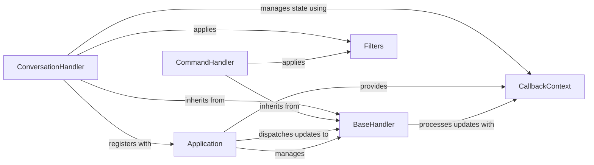

## Details

The python-telegram-bot's extension (ext) subsystem is designed around a robust event-driven architecture. The Application serves as the central hub, responsible for receiving incoming Telegram updates and efficiently routing them to specialized BaseHandler components. Handlers like CommandHandler and ConversationHandler extend BaseHandler, implementing specific logic to process different types of updates. Filters are integral, allowing handlers to precisely define which updates they are interested in. All update processing is facilitated by the CallbackContext, a crucial component provided by the Application, which encapsulates all relevant data for a given update, enabling handlers to perform their tasks and manage state effectively.

### Application
Acts as the central dispatcher for incoming updates. It registers handlers, fetches updates, and dispatches them to the appropriate handlers based on their check_update methods. It orchestrates the overall bot lifecycle.

**Related Classes/Methods**:

- <a href="https://github.com/python-telegram-bot/python-telegram-bot/blob/master/examples/arbitrarycallbackdatabot.py" target="_blank" rel="noopener noreferrer">`Application`</a>

### BaseHandler
Defines the abstract interface for all handlers. It mandates check_update (to determine if an update is relevant) and handle_update (to process the update) methods, ensuring a consistent contract for all handler types.

**Related Classes/Methods**:

- <a href="https://github.com/python-telegram-bot/python-telegram-bot/blob/master/src/telegram/ext/_handlers/basehandler.py#L36-L176" target="_blank" rel="noopener noreferrer">`BaseHandler`:36-176</a>

### CommandHandler
Specializes in processing Telegram commands (messages starting with '/'). It parses the command and arguments, and triggers the associated callback.

**Related Classes/Methods**:

- <a href="https://github.com/python-telegram-bot/python-telegram-bot/blob/master/src/telegram/ext/_handlers/commandhandler.py#L37-L224" target="_blank" rel="noopener noreferrer">`CommandHandler`:37-224</a>

### ConversationHandler
Manages multi-step, stateful conversations with users. It handles state transitions, timeouts, and persistence of conversation data across multiple updates.

**Related Classes/Methods**:

- <a href="https://github.com/python-telegram-bot/python-telegram-bot/blob/master/src/telegram/ext/_handlers/conversationhandler.py#L110-L959" target="_blank" rel="noopener noreferrer">`ConversationHandler`:110-959</a>

### Filters
Provides a flexible mechanism to define criteria for matching incoming updates (e.g., message type, chat ID, command, regex).

**Related Classes/Methods**:

- <a href="https://github.com/python-telegram-bot/python-telegram-bot/blob/master/src/telegram/ext/_handlers/commandhandler.py" target="_blank" rel="noopener noreferrer">`Filters`</a>

### CallbackContext
Encapsulates contextual data relevant to an update and its processing. This includes the Bot instance, the Update object, and user/chat-specific data (user_data, chat_data).

**Related Classes/Methods**:

- <a href="https://github.com/python-telegram-bot/python-telegram-bot/blob/master/src/telegram/ext/_callbackcontext.py#L46-L429" target="_blank" rel="noopener noreferrer">`CallbackContext`:46-429</a>

### [FAQ](https://github.com/CodeBoarding/GeneratedOnBoardings/tree/main?tab=readme-ov-file#faq)