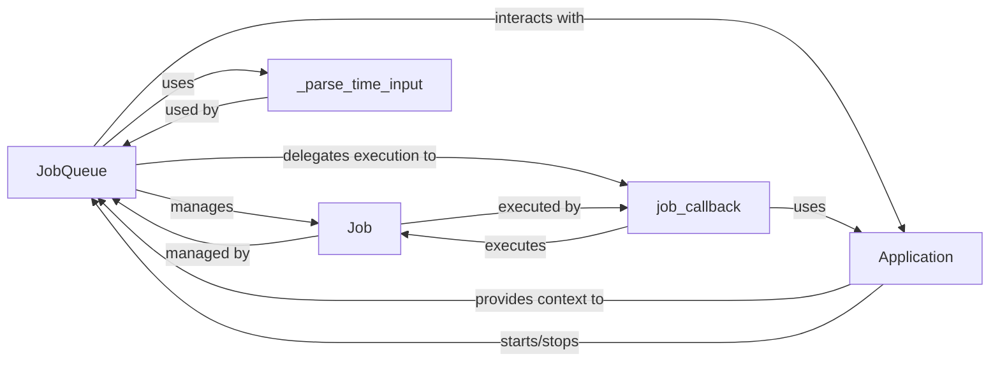

## Details

The Job Queue subsystem in `python-telegram-bot` is centered around the `JobQueue` component, which acts as a wrapper for the `APScheduler` library to manage scheduled tasks. `JobQueue` is responsible for creating and orchestrating `Job` instances, each representing a specific task with its callback and trigger conditions. It utilizes an internal `_parse_time_input` method to standardize time inputs for scheduling and delegates the actual execution of job callbacks to the `job_callback` static method. The entire subsystem operates within the broader `Application` context, which provides the necessary environment and lifecycle management, including starting and stopping the `JobQueue`.

### JobQueue
The central orchestrator for scheduling, managing, and executing various types of jobs (one-time, repeating, daily, monthly, custom). It initializes and manages the underlying APScheduler, parses time inputs, and integrates with the main `Application` context. It provides methods to add, remove, and retrieve scheduled jobs.

**Related Classes/Methods**:

- <a href="https://github.com/python-telegram-bot/python-telegram-bot/blob/master/src/telegram/ext/_jobqueue.py#L55-L738" target="_blank" rel="noopener noreferrer">`telegram.ext._jobqueue.JobQueue`:55-738</a>

### Job
Represents an individual scheduled task. It encapsulates the callback function to be executed, its arguments, the trigger conditions (time, interval), and other job-specific metadata. It embodies the Command pattern, where the `Job` object is the command to be executed at a later time.

**Related Classes/Methods**:

- <a href="https://github.com/python-telegram-bot/python-telegram-bot/blob/master/src/telegram/ext/_jobqueue.py#L906-L913" target="_blank" rel="noopener noreferrer">`telegram.ext._jobqueue.Job`:906-913</a>

### _parse_time_input
An internal helper method used by `JobQueue` to standardize and interpret various time-related inputs (e.g., `datetime` objects, `time` objects, `timedelta` objects) into a format suitable for scheduling. This component is crucial for abstracting time input complexities.

**Related Classes/Methods**:

### job_callback
A static method within `JobQueue` that encapsulates the core logic for safely executing a scheduled job's callback. This includes handling potential exceptions during execution and ensuring the callback runs within the appropriate context. `JobQueue` delegates the actual execution of a `Job`'s callback to this function, which is then called by the underlying APScheduler.

**Related Classes/Methods**:

### Application
While not strictly part of the `Job Queue` subsystem's internal implementation, the `Application` component from the broader `python-telegram-bot` framework provides the necessary environment (e.g., event loop, bot instance, context objects) for `JobQueue` to operate and for job callbacks to be executed within the bot's operational context. It acts as the external dependency providing the runtime environment.

**Related Classes/Methods**:

- <a href="https://github.com/python-telegram-bot/python-telegram-bot/blob/master/src/telegram/ext/_application.py#L118-L1941" target="_blank" rel="noopener noreferrer">`telegram.ext._application.Application`:118-1941</a>

### [FAQ](https://github.com/CodeBoarding/GeneratedOnBoardings/tree/main?tab=readme-ov-file#faq)