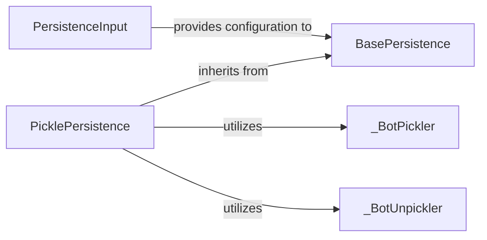

## Details

The `Persistence Layer` subsystem is designed to provide robust mechanisms for saving and loading bot, user, chat, and conversation data, ensuring state persistence across application restarts. It adheres to an abstract interface pattern, allowing for flexible concrete implementations. The core of the Persistence Layer is encapsulated within the `src.telegram.ext._basepersistence.py` and `src.telegram.ext._picklepersistence.py` files. These files define the abstract interface and a concrete implementation for data persistence.

### BasePersistence
This is the foundational abstract component, defining the contract for any persistence mechanism. It acts as an API Abstraction for data storage, ensuring that any concrete implementation adheres to a standard interface for saving and loading bot, user, chat, and conversation data. It also handles initial configuration via `PersistenceInput`.

**Related Classes/Methods**:

- <a href="https://github.com/python-telegram-bot/python-telegram-bot/blob/master/src/telegram/ext/_basepersistence.py#L57-L441" target="_blank" rel="noopener noreferrer">`telegram.ext._basepersistence.BasePersistence`:57-441</a>

### PicklePersistence
Implements the `BasePersistence` interface using Python's `pickle` module for serialization and deserialization. It manages the actual file I/O operations and handles the specific logic for storing and retrieving different data types (user data, chat data, bot data, conversations, callback data). It acts as a concrete API Wrapper around the pickle library and the file system.

**Related Classes/Methods**:

- <a href="https://github.com/python-telegram-bot/python-telegram-bot/blob/master/src/telegram/ext/_picklepersistence.py#L121-L563" target="_blank" rel="noopener noreferrer">`telegram.ext._picklepersistence.PicklePersistence`:121-563</a>

### PersistenceInput
Provides configuration parameters to `BasePersistence` and its implementations, such as whether to persist user data, chat data, or conversations. This component enhances the modularity and configurability of the persistence layer.

**Related Classes/Methods**:

- <a href="https://github.com/python-telegram-bot/python-telegram-bot/blob/master/src/telegram/ext/_basepersistence.py#L29-L54" target="_blank" rel="noopener noreferrer">`telegram.ext._basepersistence.PersistenceInput`:29-54</a>

### _BotPickler
An internal helper class responsible for handling the custom serialization of specific bot-related objects that might require special handling beyond standard pickle behavior. It is crucial for the robustness of `PicklePersistence` in a complex application like a bot.

**Related Classes/Methods**:

- <a href="https://github.com/python-telegram-bot/python-telegram-bot/blob/master/src/telegram/ext/_picklepersistence.py#L71-L102" target="_blank" rel="noopener noreferrer">`telegram.ext._picklepersistence._BotPickler`:71-102</a>

### _BotUnpickler
An internal helper class responsible for handling the custom deserialization of specific bot-related objects that might require special handling beyond standard pickle behavior. It is crucial for the robustness of `PicklePersistence` in a complex application like a bot.

**Related Classes/Methods**:

- <a href="https://github.com/python-telegram-bot/python-telegram-bot/blob/master/src/telegram/ext/_picklepersistence.py#L105-L118" target="_blank" rel="noopener noreferrer">`telegram.ext._picklepersistence._BotUnpickler`:105-118</a>

### [FAQ](https://github.com/CodeBoarding/GeneratedOnBoardings/tree/main?tab=readme-ov-file#faq)