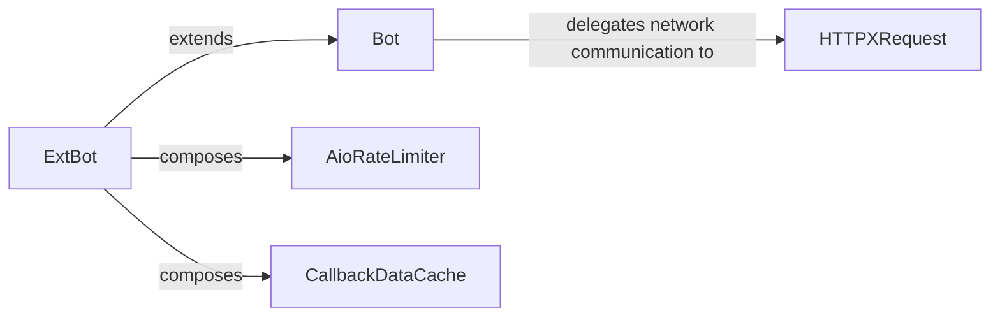

## Details

The `Telegram API Client` subsystem encompasses the core components responsible for direct communication with the Telegram Bot API. This includes handling API requests and responses, managing network interactions, and providing extended features like rate limiting and callback data processing.

### Bot
Serves as the foundational interface for interacting with the Telegram Bot API. It is responsible for constructing API requests, sending them, and parsing raw JSON responses into structured Telegram objects. It manages fundamental bot details like the token and base URL.

**Related Classes/Methods**:

- <a href="https://github.com/python-telegram-bot/python-telegram-bot/blob/master/src/telegram/_bot.py#L529-L545" target="_blank" rel="noopener noreferrer">`telegram._bot.Bot`:529-545</a>

### ExtBot
Extends the `Bot` class, inheriting its core API interaction capabilities. It adds advanced features crucial for a robust SDK, such as enforcing rate limits on outgoing API requests and providing sophisticated management for callback data used in inline keyboards. It also integrates default parameters for API calls.

**Related Classes/Methods**:

- <a href="https://github.com/python-telegram-bot/python-telegram-bot/blob/master/src/telegram/ext/_extbot.py#L139-L5301" target="_blank" rel="noopener noreferrer">`telegram.ext._extbot.ExtBot`:139-5301</a>

### HTTPXRequest
Acts as the low-level HTTP client. It is responsible for executing the actual HTTP POST/GET requests to the Telegram API endpoint. This includes managing network concerns like connection pooling, timeouts, and proxy settings, and parsing the raw JSON payloads received from API responses.

**Related Classes/Methods**:

- <a href="https://github.com/python-telegram-bot/python-telegram-bot/blob/master/src/telegram/request/_httpxrequest.py#L41-L305" target="_blank" rel="noopener noreferrer">`telegram.request._httpxrequest.HTTPXRequest`:41-305</a>

### AioRateLimiter
A utility component specifically designed to manage and enforce rate limits on outgoing API requests. It ensures that the bot complies with Telegram API usage policies, preventing excessive requests within a given timeframe.

**Related Classes/Methods**:

- <a href="https://github.com/python-telegram-bot/python-telegram-bot/blob/master/src/telegram/ext/_aioratelimiter.py#L57-L300" target="_blank" rel="noopener noreferrer">`telegram.ext._aioratelimiter.AioRateLimiter`:57-300</a>

### CallbackDataCache
A utility component that handles the serialization and deserialization of callback data associated with inline keyboard buttons. It simplifies the process of managing and retrieving data linked to user interactions with inline keyboards.

**Related Classes/Methods**:

- <a href="https://github.com/python-telegram-bot/python-telegram-bot/blob/master/src/telegram/ext/_callbackdatacache.py#L109-L470" target="_blank" rel="noopener noreferrer">`telegram.ext._callbackdatacache.CallbackDataCache`:109-470</a>

### [FAQ](https://github.com/CodeBoarding/GeneratedOnBoardings/tree/main?tab=readme-ov-file#faq)