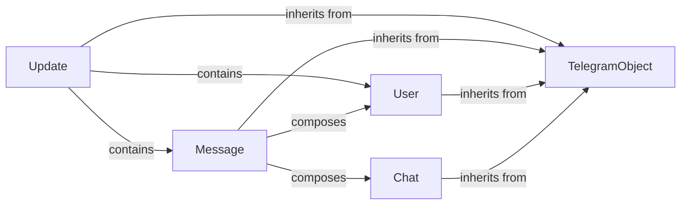

## Details

The `python-telegram-bot` library's core subsystem for handling Telegram API data is built around a hierarchical structure rooted in the `TelegramObject` abstract base class. This foundation ensures consistency and provides common serialization/deserialization capabilities across all Telegram API entities. Key components like `Update`, `Message`, `User`, and `Chat` extend `TelegramObject`, inheriting its fundamental properties. The `Update` component serves as the primary entry point for all incoming data from the Telegram API, encapsulating various event types. `Message` objects, representing individual chat messages, are often contained within `Update` objects. Furthermore, `Message` objects compose `User` and `Chat` objects, providing essential context about the sender and the conversation environment. This composition allows for a rich and structured representation of Telegram interactions, enabling the bot to process and respond to diverse events effectively.

### TelegramObject
The foundational abstract base class for all Telegram API data models. It provides common functionalities such as object initialization, deserialization from JSON, and serialization to a dictionary. It also manages the associated `Bot` instance, allowing derived classes to interact with the Telegram API.

**Related Classes/Methods**:

- <a href="https://github.com/python-telegram-bot/python-telegram-bot/blob/master/src/telegram/_telegramobject.py#L43-L693" target="_blank" rel="noopener noreferrer">`telegram._telegramobject.TelegramObject`:43-693</a>

### Update
Represents an incoming update from the Telegram API, serving as the primary entry point for all incoming data. It encapsulates various types of updates (e.g., new messages, callback queries) and acts as the primary data structure for the event-driven architecture.

**Related Classes/Methods**:

- <a href="https://github.com/python-telegram-bot/python-telegram-bot/blob/master/src/telegram/update.py" target="_blank" rel="noopener noreferrer">`telegram.update.Update`</a>

### Message
Represents a single message within a chat. It provides structured access to message content, sender, chat, and various message properties. It also includes methods for interacting with the API (e.g., `reply_text`, `edit_text`).

**Related Classes/Methods**:

- <a href="https://github.com/python-telegram-bot/python-telegram-bot/blob/master/src/telegram/message.py" target="_blank" rel="noopener noreferrer">`telegram.message.Message`</a>

### User
Represents a Telegram user account, providing basic information like ID, first name, last name, and username. It includes utilities for generating user mentions.

**Related Classes/Methods**:

- <a href="https://github.com/python-telegram-bot/python-telegram-bot/blob/master/src/telegram/user.py" target="_blank" rel="noopener noreferrer">`telegram.user.User`</a>

### Chat
Represents various types of Telegram chats (private, group, channel), offering details and methods for generating chat-specific mentions, and providing information about the chat type, title, and ID.

**Related Classes/Methods**:

- <a href="https://github.com/python-telegram-bot/python-telegram-bot/blob/master/src/telegram/chat.py" target="_blank" rel="noopener noreferrer">`telegram.chat.Chat`</a>

### [FAQ](https://github.com/CodeBoarding/GeneratedOnBoardings/tree/main?tab=readme-ov-file#faq)