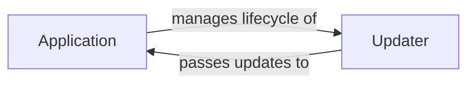

## Details

The core of the Telegram bot's operation revolves around the `Application` and `Updater` components. The `Application` acts as the central orchestrator, responsible for the bot's overall lifecycle management, from startup to shutdown. It coordinates the processing and dispatching of updates. The `Updater` component is dedicated to interacting directly with the Telegram API to fetch these updates, handling the underlying mechanisms like long polling or webhooks. The `Application` manages the lifecycle of the `Updater`, ensuring its proper operation, while the `Updater` continuously passes retrieved updates to the `Application` for further processing and distribution to handlers. This clear separation of concerns ensures efficient update retrieval and robust application management.

### Application
The Application component serves as the central orchestrator for the Telegram bot. It manages the bot's overall lifecycle, including startup and shutdown. Its core responsibilities involve coordinating the fetching of updates, processing them, and dispatching them to the appropriate registered handlers. It also integrates with other essential components such as the persistence layer and job scheduling mechanisms.

**Related Classes/Methods**:

- <a href="https://github.com/python-telegram-bot/python-telegram-bot/blob/master/src/telegram/ext/_application.py#L118-L1941" target="_blank" rel="noopener noreferrer">`src.telegram.ext._application.Application`:118-1941</a>

### Updater
The Updater component is specifically tasked with the direct interaction with the Telegram API to retrieve updates. It handles the mechanics of fetching updates, whether through long polling or webhook mechanisms. It manages its own internal lifecycle related to the continuous process of update retrieval.

**Related Classes/Methods**:

- <a href="https://github.com/python-telegram-bot/python-telegram-bot/blob/master/src/telegram/ext/_updater.py#L54-L777" target="_blank" rel="noopener noreferrer">`src.telegram.ext._updater.Updater`:54-777</a>

### [FAQ](https://github.com/CodeBoarding/GeneratedOnBoardings/tree/main?tab=readme-ov-file#faq)