```mermaid
graph LR
    Telegram_API_Client["Telegram API Client"]
    Update_Dispatcher["Update Dispatcher"]
    Handler_System["Handler System"]
    Telegram_Data_Models["Telegram Data Models"]
    Persistence_Layer["Persistence Layer"]
    Job_Queue["Job Queue"]
    External_Telegram_API["External Telegram API"]
    External_Telegram_API -- "sends updates to" --> Telegram_API_Client
    Telegram_API_Client -- "sends requests to" --> External_Telegram_API
    Telegram_API_Client -- "forwards updates to" --> Update_Dispatcher
    Update_Dispatcher -- "dispatches updates to" --> Handler_System
    Handler_System -- "uses" --> Telegram_API_Client
    Update_Dispatcher -- "interacts with" --> Persistence_Layer
    Handler_System -- "interacts with" --> Persistence_Layer
    Update_Dispatcher -- "manages" --> Job_Queue
    Job_Queue -- "triggers" --> Handler_System
    Handler_System -- "processes" --> Telegram_Data_Models
    Handler_System -- "constructs/modifies" --> Telegram_Data_Models
    click Telegram_API_Client href "https://github.com/CodeBoarding/GeneratedOnBoardings/blob/main/python-telegram-bot/Telegram_API_Client.md" "Details"
    click Update_Dispatcher href "https://github.com/CodeBoarding/GeneratedOnBoardings/blob/main/python-telegram-bot/Update_Dispatcher.md" "Details"
    click Handler_System href "https://github.com/CodeBoarding/GeneratedOnBoardings/blob/main/python-telegram-bot/Handler_System.md" "Details"
    click Telegram_Data_Models href "https://github.com/CodeBoarding/GeneratedOnBoardings/blob/main/python-telegram-bot/Telegram_Data_Models.md" "Details"
    click Persistence_Layer href "https://github.com/CodeBoarding/GeneratedOnBoardings/blob/main/python-telegram-bot/Persistence_Layer.md" "Details"
    click Job_Queue href "https://github.com/CodeBoarding/GeneratedOnBoardings/blob/main/python-telegram-bot/Job_Queue.md" "Details"
```

## Details

The `python-telegram-bot` architecture is centered around an `Update Dispatcher` that orchestrates the flow of information. It receives incoming updates from the `External Telegram API` through the `Telegram API Client`, which also handles all outgoing API calls. The `Update Dispatcher` then routes these updates to the `Handler System`, a modular collection of handlers that encapsulate specific bot logic. The system leverages a `Persistence Layer` for state management and a `Job Queue` for scheduling tasks. All interactions and data representations within the system are facilitated by `Telegram Data Models`, ensuring structured communication and processing. This design promotes modularity, allowing developers to easily extend bot functionalities by adding new handlers and integrating with external services.

### Telegram API Client [[Expand]](./Telegram_API_Client.md)
Manages all direct communication with the Telegram Bot API, handling requests and responses, including extended features like rate limiting and callback data processing.

**Related Classes/Methods**:

- <a href="https://github.com/python-telegram-bot/python-telegram-bot/blob/master/src/telegram/_bot.py#L529-L545" target="_blank" rel="noopener noreferrer">`src.telegram._bot.Bot`:529-545</a>
- <a href="https://github.com/python-telegram-bot/python-telegram-bot/blob/master/src/telegram/ext/_extbot.py#L139-L5301" target="_blank" rel="noopener noreferrer">`src.telegram.ext._extbot.ExtBot`:139-5301</a>
- <a href="https://github.com/python-telegram-bot/python-telegram-bot/blob/master/src/telegram/request/_httpxrequest.py#L41-L305" target="_blank" rel="noopener noreferrer">`src.telegram.request._httpxrequest.HTTPXRequest`:41-305</a>

### Update Dispatcher [[Expand]](./Update_Dispatcher.md)
The central control unit responsible for fetching updates from Telegram, managing the bot's lifecycle (startup/shutdown), and dispatching updates to the appropriate handlers. It also coordinates with the persistence layer and job scheduling.

**Related Classes/Methods**:

- <a href="https://github.com/python-telegram-bot/python-telegram-bot/blob/master/src/telegram/ext/_application.py#L118-L1941" target="_blank" rel="noopener noreferrer">`src.telegram.ext._application.Application`:118-1941</a>
- <a href="https://github.com/python-telegram-bot/python-telegram-bot/blob/master/src/telegram/ext/_updater.py#L54-L777" target="_blank" rel="noopener noreferrer">`src.telegram.ext._updater.Updater`:54-777</a>

### Handler System [[Expand]](./Handler_System.md)
Defines the modular logic for processing different types of incoming updates. Handlers are registered with the Dispatcher and executed when their filters match an update, encapsulating specific bot behaviors.

**Related Classes/Methods**:

- <a href="https://github.com/python-telegram-bot/python-telegram-bot/blob/master/src/telegram/ext/_handlers/basehandler.py#L36-L176" target="_blank" rel="noopener noreferrer">`src.telegram.ext._handlers.basehandler.BaseHandler`:36-176</a>
- <a href="https://github.com/python-telegram-bot/python-telegram-bot/blob/master/src/telegram/ext/_handlers/commandhandler.py#L37-L224" target="_blank" rel="noopener noreferrer">`src.telegram.ext._handlers.commandhandler.CommandHandler`:37-224</a>
- <a href="https://github.com/python-telegram-bot/python-telegram-bot/blob/master/src/telegram/ext/_handlers/conversationhandler.py#L110-L959" target="_blank" rel="noopener noreferrer">`src.telegram.ext._handlers.conversationhandler.ConversationHandler`:110-959</a>

### Telegram Data Models [[Expand]](./Telegram_Data_Models.md)
Pythonic representations of Telegram API objects (e.g., Message, User, Chat, Update). These objects facilitate structured access to data received from and sent to the API.

**Related Classes/Methods**:

- <a href="https://github.com/python-telegram-bot/python-telegram-bot/blob/master/src/telegram/_update.py#L46-L813" target="_blank" rel="noopener noreferrer">`src.telegram._update.Update`:46-813</a>
- <a href="https://github.com/python-telegram-bot/python-telegram-bot/blob/master/src/telegram/_message.py#L253-L5366" target="_blank" rel="noopener noreferrer">`src.telegram._message.Message`:253-5366</a>
- <a href="https://github.com/python-telegram-bot/python-telegram-bot/blob/master/src/telegram/_user.py#L73-L2395" target="_blank" rel="noopener noreferrer">`src.telegram._user.User`:73-2395</a>
- <a href="https://github.com/python-telegram-bot/python-telegram-bot/blob/master/src/telegram/_chat.py#L3686-L3740" target="_blank" rel="noopener noreferrer">`src.telegram._chat.Chat`:3686-3740</a>

### Persistence Layer [[Expand]](./Persistence_Layer.md)
Provides mechanisms to save and load bot, user, chat, and conversation data, allowing the bot to maintain state across restarts. It offers an abstract interface with concrete implementations.

**Related Classes/Methods**:

- <a href="https://github.com/python-telegram-bot/python-telegram-bot/blob/master/src/telegram/ext/_basepersistence.py#L57-L441" target="_blank" rel="noopener noreferrer">`src.telegram.ext._basepersistence.BasePersistence`:57-441</a>
- <a href="https://github.com/python-telegram-bot/python-telegram-bot/blob/master/src/telegram/ext/_picklepersistence.py#L121-L563" target="_blank" rel="noopener noreferrer">`src.telegram.ext._picklepersistence.PicklePersistence`:121-563</a>

### Job Queue [[Expand]](./Job_Queue.md)
Enables scheduling one-time or recurring tasks to be executed at specific times or intervals within the bot's operational context, often used for background operations or timed messages.

**Related Classes/Methods**:

- <a href="https://github.com/python-telegram-bot/python-telegram-bot/blob/master/src/telegram/ext/_jobqueue.py#L55-L738" target="_blank" rel="noopener noreferrer">`src.telegram.ext._jobqueue.JobQueue`:55-738</a>

### External Telegram API
The external API provided by Telegram for bot interactions. This component is external to the project and therefore does not have internal source code references.

**Related Classes/Methods**: _None_

### [FAQ](https://github.com/CodeBoarding/GeneratedOnBoardings/tree/main?tab=readme-ov-file#faq)